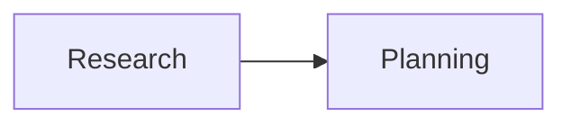

# surrealdb_for_workflow.py — 实现原理分析

<!-- cookbook-py-source:start -->
## 完整源码

````python
r"""
Run SurrealDB in a container before running this script

```
docker run --rm --pull always -p 8000:8000 surrealdb/surrealdb:latest start --user root --pass root
```

or with

```
surreal start -u root -p root
```

Then:

1. Run: `uv pip install anthropic ddgs newspaper4k lxml_html_clean surrealdb agno` to install the dependencies.
2. Run: `python cookbook/db/surrealdb/surrealdb_for_workflow.py` to run the workflow.
"""

from agno.agent import Agent
from agno.db.surrealdb import SurrealDb
from agno.models.anthropic import Claude
from agno.team import Team
from agno.tools.hackernews import HackerNewsTools
from agno.tools.websearch import WebSearchTools
from agno.workflow.step import Step
from agno.workflow.workflow import Workflow

# ---------------------------------------------------------------------------
# Setup
# ---------------------------------------------------------------------------
SURREALDB_URL = "ws://localhost:8000"
SURREALDB_USER = "root"
SURREALDB_PASSWORD = "root"
SURREALDB_NAMESPACE = "agno"
SURREALDB_DATABASE = "surrealdb_for_workflow"

creds = {"username": SURREALDB_USER, "password": SURREALDB_PASSWORD}
db = SurrealDb(None, SURREALDB_URL, creds, SURREALDB_NAMESPACE, SURREALDB_DATABASE)

# ---------------------------------------------------------------------------
# Create Workflow
# ---------------------------------------------------------------------------
hackernews_agent = Agent(
    name="Hackernews Agent",
    model=Claude(id="claude-sonnet-4-5-20250929"),
    tools=[HackerNewsTools()],
    role="Extract key insights and content from Hackernews posts",
)
web_agent = Agent(
    name="Web Agent",
    model=Claude(id="claude-sonnet-4-5-20250929"),
    tools=[WebSearchTools()],
    role="Search the web for the latest news and trends",
)

# Define research team for complex analysis
research_team = Team(
    name="Research Team",
    model=Claude(id="claude-sonnet-4-5-20250929"),
    members=[hackernews_agent, web_agent],
    instructions="Research tech topics from Hackernews and the web",
)

content_planner = Agent(
    name="Content Planner",
    model=Claude(id="claude-sonnet-4-5-20250929"),
    instructions=[
        "Plan a content schedule over 4 weeks for the provided topic and research content",
        "Ensure that I have posts for 3 posts per week",
    ],
)

# Define steps
research_step = Step(
    name="Research Step",
    team=research_team,
)

content_planning_step = Step(
    name="Content Planning Step",
    agent=content_planner,
)

# ---------------------------------------------------------------------------
# Run Workflow
# ---------------------------------------------------------------------------
if __name__ == "__main__":
    content_creation_workflow = Workflow(
        name="Content Creation Workflow",
        description="Automated content creation from blog posts to social media",
        db=db,
        steps=[research_step, content_planning_step],
    )
    content_creation_workflow.print_response(
        input="AI trends in 2024",
        markdown=True,
    )
````

<!-- cookbook-py-source:end -->

> 源文件：`cookbook/06_storage/surrealdb/surrealdb_for_workflow.py`

## 概述

本示例展示 **SurrealDb** 作为 **Workflow** 的 `db`：`Workflow(..., db=...)` 持久化工作流会话；结构为 **Team 研究步 + Agent 规划步**（与 `postgres_for_workflow.py` 一致）。

**核心配置一览：**

| 配置项 | 值 | 说明 |
|--------|------|------|
| `research_team` | `Team(members=[...], instructions=...)` | 第一步 |
| `content_planner` | `OpenAIChat`, `instructions` 列表 | 第二步 |
| `Workflow` | `db=SurrealDb(...)` | 会话表见源文件 |

## 架构分层

`Workflow.print_response` → 各 Step → Agent/Team run → DB。

## System Prompt 组装

分步还原见各 Agent/Team 源码；无单一 OS 级 system。

## 完整 API 请求

各步 `OpenAIChat.invoke` / Team 主循环。

## Mermaid 流程图



## 关键源码文件索引

| 文件 | 作用 |
|------|------|
| `agno/workflow/workflow.py` | `Workflow` |
| `agno/db/*` | `db` 参数 |
