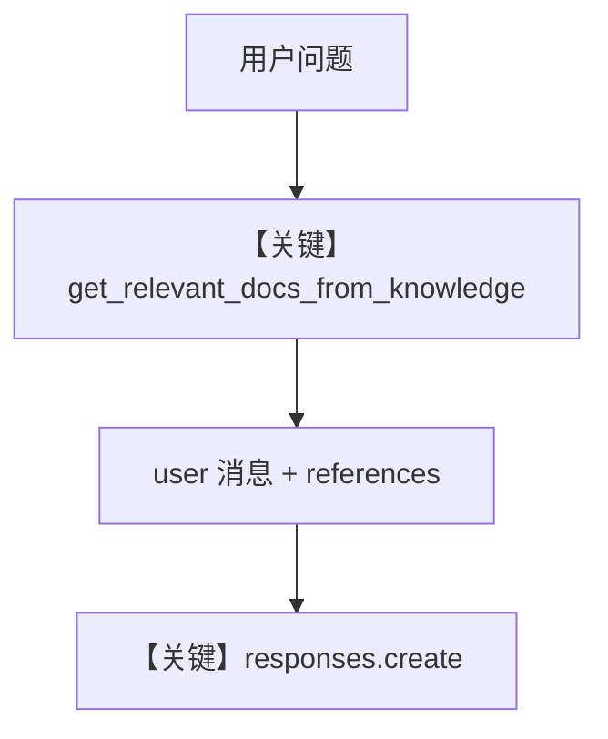

# 01_basic_rag.py — 实现原理分析

<!-- cookbook-py-source:start -->
## 完整源码

```python
"""
Basic RAG: Context Injection
=============================
The simplest way to give an agent access to documents. Content is automatically
retrieved and injected into the system prompt before the agent responds.

This pattern works well for simple Q&A over documents. The agent doesn't need
to decide whether to search - it always gets relevant context.

Steps:
1. Create a Knowledge base with a vector database
2. Load a document
3. Create an Agent with add_knowledge_to_context=True
4. Ask questions - context is injected automatically

See also: 02_agentic_rag.py for agent-driven search decisions.
"""

import asyncio

from agno.agent import Agent
from agno.knowledge.embedder.openai import OpenAIEmbedder
from agno.knowledge.knowledge import Knowledge
from agno.models.openai import OpenAIResponses
from agno.vectordb.qdrant import Qdrant
from agno.vectordb.search import SearchType

# ---------------------------------------------------------------------------
# Setup
# ---------------------------------------------------------------------------

qdrant_url = "http://localhost:6333"

knowledge = Knowledge(
    vector_db=Qdrant(
        collection="basic_rag",
        url=qdrant_url,
        search_type=SearchType.hybrid,
        embedder=OpenAIEmbedder(id="text-embedding-3-small"),
    ),
)

# ---------------------------------------------------------------------------
# Create Agent
# ---------------------------------------------------------------------------

# Traditional RAG: context is fetched and injected into the prompt automatically.
# The agent doesn't get a search tool - it just sees the relevant context.
agent = Agent(
    model=OpenAIResponses(id="gpt-5.2"),
    knowledge=knowledge,
    add_knowledge_to_context=True,
    search_knowledge=False,
    markdown=True,
)

# ---------------------------------------------------------------------------
# Run Demo
# ---------------------------------------------------------------------------

if __name__ == "__main__":

    async def main():
        await knowledge.ainsert(
            url="https://agno-public.s3.amazonaws.com/recipes/ThaiRecipes.pdf"
        )

        print("\n" + "=" * 60)
        print("Basic RAG: Context injected into prompt automatically")
        print("=" * 60 + "\n")

        agent.print_response(
            "How do I make chicken and galangal in coconut milk soup",
            stream=True,
        )

    asyncio.run(main())
```

<!-- cookbook-py-source:end -->

> 源文件：`cookbook/07_knowledge/01_getting_started/01_basic_rag.py`

## 概述

本示例展示 Agno 的 **传统 RAG（自动注入上下文）**：`add_knowledge_to_context=True` 且 **`search_knowledge=False`**，模型不接收 `search_knowledge_base` 工具；检索在 `get_run_messages` 路径上把文档拼进 **用户消息** 的 `<references>` 段（见 `agno/agent/_messages.py` 约 L954–964）。

**核心配置一览：**

| 配置项 | 值 | 说明 |
|--------|------|------|
| `knowledge` | `Knowledge(vector_db=Qdrant(..., SearchType.hybrid, OpenAIEmbedder))` | 向量库 |
| `model` | `OpenAIResponses(id="gpt-5.2")` | **Responses API**（非 Chat Completions） |
| `add_knowledge_to_context` | `True` | 注入检索结果到用户侧上下文 |
| `search_knowledge` | `False` | 关闭 agentic 检索工具 |
| `markdown` | `True` | Markdown 附加说明进 system |

## 架构分层

```
knowledge.ainsert → Qdrant 索引
Agent.print_response → get_run_messages
  → get_relevant_docs_from_knowledge（add_knowledge_to_context=True）
  → 用户 Message 附加 <references>（_messages.py 约 L954–964）
→ OpenAIResponses.invoke → responses.create（responses.py 约 L691–694）
```

## 核心组件解析

### 与 Agentic RAG 的差异

| 配置 | 本文件（Basic） | `02_agentic_rag.py` |
|------|----------------|---------------------|
| `search_knowledge` | `False` | `True`（默认） |
| 检索触发 | 每轮自动按用户查询检索 | 模型通过工具决定何时搜 |

### 运行机制与因果链

1. **数据路径**：PDF URL → `ainsert` 切块嵌入 → 用户提问 → 检索 → 引用块进入 user 消息 → Responses API。
2. **副作用**：写入 Qdrant；无单独 session 表示（未显式 `db`）。
3. **定位**：**最简单问答**，不适合需多跳自主检索的复杂任务。

## System Prompt 组装

无自定义 `instructions`/`description`；`markdown=True` 触发 `# 3.2.1`。**知识正文不放在 system**，而在 user 消息的 `<references>`（当 `add_knowledge_to_context=True`）。

### 拼装顺序与源码锚点

- System：`get_system_message` 默认拼装（`_messages.py` L106+）。
- User：构造用户消息时若 `add_knowledge_to_context`（约 L915+），先 `get_relevant_docs_from_knowledge`，再拼 `<references>`（约 L954–964）。

### 还原后的完整 System 文本

无静态长 `instructions`；可预期包含：

```text
Use markdown to format your answers.
```

（来自 `# 3.2.1`；时间等未启用则无。）

User 侧含动态 `<references>`，无法事先逐字还原，请在 `get_run_messages` 返回前打印 `user` 消息内容验证。

## 完整 API 请求

```python
# agno/models/openai/responses.py OpenAIResponses.invoke 约 L691+
client.responses.create(
    model="gpt-5.2",
    input=OpenAIResponses._format_messages(...),  # 含 system + user（user 内嵌 <references>）
)
```

> 使用 **Responses** 而非 `chat.completions.create`。

## Mermaid 流程图



## 关键源码文件索引

| 文件 | 关键函数/类 | 作用 |
|------|------------|------|
| `agno/agent/_messages.py` | `get_run_messages` 约 L915–964 | 引用注入 user |
| `agno/models/openai/responses.py` | `invoke()` L671+ | Responses API |
| `agno/knowledge/knowledge.py` | `Knowledge` | RAG 入口 |
