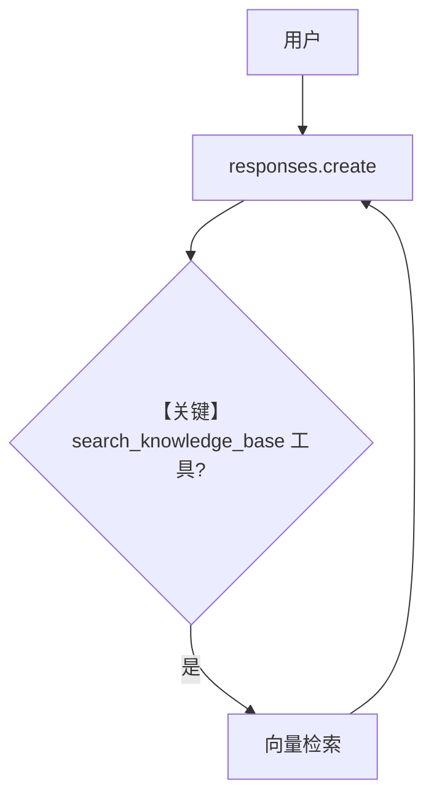

# 02_agentic_rag.py — 实现原理分析

<!-- cookbook-py-source:start -->
## 完整源码

```python
"""
Agentic RAG: Tool-Based Search
================================
The agent gets a search_knowledge_base tool and decides when to query the
knowledge base. This is more flexible than basic RAG - the agent can choose
to search multiple times, refine queries, or skip searching entirely.

This is the default behavior when you set knowledge on an Agent.

Steps:
1. Create a Knowledge base with a vector database
2. Load a document
3. Create an Agent with search_knowledge=True (the default)
4. Ask questions - agent decides when to search

See also: 01_basic_rag.py for automatic context injection.
"""

import asyncio

from agno.agent import Agent
from agno.knowledge.embedder.openai import OpenAIEmbedder
from agno.knowledge.knowledge import Knowledge
from agno.models.openai import OpenAIResponses
from agno.vectordb.qdrant import Qdrant
from agno.vectordb.search import SearchType

# ---------------------------------------------------------------------------
# Setup
# ---------------------------------------------------------------------------

qdrant_url = "http://localhost:6333"

knowledge = Knowledge(
    vector_db=Qdrant(
        collection="agentic_rag",
        url=qdrant_url,
        search_type=SearchType.hybrid,
        embedder=OpenAIEmbedder(id="text-embedding-3-small"),
    ),
)

# ---------------------------------------------------------------------------
# Create Agent
# ---------------------------------------------------------------------------

# Agentic RAG: the agent gets a search tool and decides when to use it.
# This is the default when knowledge is provided to an Agent.
agent = Agent(
    model=OpenAIResponses(id="gpt-5.2"),
    knowledge=knowledge,
    search_knowledge=True,
    markdown=True,
)

# ---------------------------------------------------------------------------
# Run Demo
# ---------------------------------------------------------------------------

if __name__ == "__main__":

    async def main():
        await knowledge.ainsert(
            url="https://agno-public.s3.amazonaws.com/recipes/ThaiRecipes.pdf"
        )

        print("\n" + "=" * 60)
        print("Agentic RAG: Agent decides when to search")
        print("=" * 60 + "\n")

        agent.print_response(
            "How do I make chicken and galangal in coconut milk soup",
            stream=True,
        )

        print("\n" + "=" * 60)
        print("Multi-part question: agent may search multiple times")
        print("=" * 60 + "\n")

        agent.print_response(
            "I want to make a 3 course Thai meal. Can you recommend a soup, "
            "a curry for the main course, and a dessert?",
            stream=True,
        )

    asyncio.run(main())
```

<!-- cookbook-py-source:end -->

> 源文件：`cookbook/07_knowledge/01_getting_started/02_agentic_rag.py`

## 概述

本示例展示 Agno 的 **Agentic RAG**：`search_knowledge=True`（显式打开；亦为常见默认），`get_system_message` 在 `# 3.3.13` 附近通过 `knowledge.build_context` 注入检索说明（`agno/agent/_messages.py` 约 L409–418）；模型通过 **`search_knowledge_base` 工具** 自主决定检索时机与次数。

**核心配置一览：**

| 配置项 | 值 | 说明 |
|--------|------|------|
| `knowledge` | `Knowledge` + Qdrant hybrid | 同 basic 示例 |
| `model` | `OpenAIResponses(gpt-5.2)` | Responses API |
| `search_knowledge` | `True` | Agentic 检索 |
| `markdown` | `True` | Markdown |

## 架构分层

工具循环：`responses.create` → 若模型发起 `search_knowledge_base` → 执行检索 → 结果回到下一轮 `input`。

## 核心组件解析

### build_context 段

`_resolved_knowledge` 非空且 `search_knowledge` 与 `add_search_knowledge_instructions` 为真时，将 `knowledge_context` 追加到 system（约 L409–418）。

### 运行机制与因果链

1. **路径**：用户问题 → 模型可选多次搜索 → 综合回答；第二段用户问题演示多部分菜单规划。
2. **与 Basic RAG**：Basic 把检索塞进 **user references**；本示例以 **工具 + system 检索说明** 为主路径。

## System Prompt 组装

除默认段外，含 **Knowledge 生成的检索指引**（来自 `build_context`，长度与内容依赖库内文档与元数据，运行时打印确认）。

### 还原后的完整 System 文本

无法仅由 cookbook 静态还原 `build_context` 全文；请在 `get_system_message` 返回前断点查看。

## 完整 API 请求

```python
# responses.py L691+
client.responses.create(
    model="gpt-5.2",
    input=[...],  # system/developer + user，含工具定义
    tools=[...],  # 含 search_knowledge_base
)
```

## Mermaid 流程图



## 关键源码文件索引

| 文件 | 作用 |
|------|------|
| `agno/agent/_messages.py` | `# 3.3.13` 知识检索说明 L409+ |
| `agno/models/openai/responses.py` | `invoke` L671+ |
