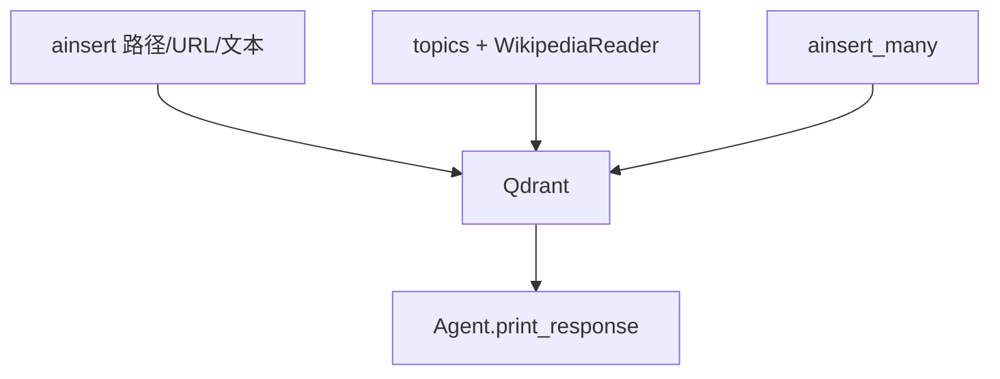

# 03_loading_content.py — 实现原理分析

> 源文件：`cookbook/07_knowledge/01_getting_started/03_loading_content.py`

## 概述

本示例展示 Agno **Knowledge 内容加载 API 全景**：本地路径、`url`、`text_content`、`topics`+`WikipediaReader`、`ainsert_many` 批量；全部使用 **异步** `ainsert` / `ainsert_many`（同步 `insert` 亦存在）。

**核心配置一览：**

| 配置项 | 值 | 说明 |
|--------|------|------|
| `knowledge` | Qdrant + hybrid + OpenAIEmbedder | 向量库 |
| `agent` | `OpenAIResponses`, `search_knowledge=True` | Agentic 检索 |
| `reader` | `WikipediaReader()` | topic 加载 |

## 架构分层

`ainsert*` 写入向量与内容库 → Agent 通过工具或上下文消费；本文件 **演示加载**，非存储后端选型。

## 核心组件解析

### 五种来源

1. 本地 PDF 路径  
2. URL PDF  
3. 原始文本  
4. Wikipedia topics  
5. `ainsert_many` 多文档  

### 运行机制与因果链

1. **副作用**：重复运行可能重复写入，除非配合 `skip_if_exists`（本文件未统一使用）。
2. **定位**：**ingest 管道参考**，与 RAG 策略正交。

## System Prompt 组装

同 `02_agentic_rag`：无自定义长 `instructions`；`search_knowledge=True` 走 `build_context` 检索说明。

## 完整 API 请求

模型调用：`OpenAIResponses` → `responses.create`（`responses.py` L691+）。

## Mermaid 流程图

## 关键源码文件索引

| 文件 | 作用 |
|------|------|
| `agno/knowledge/knowledge.py` | `ainsert`, `ainsert_many` |
| `agno/knowledge/reader/wikipedia_reader.py` | `WikipediaReader` |
