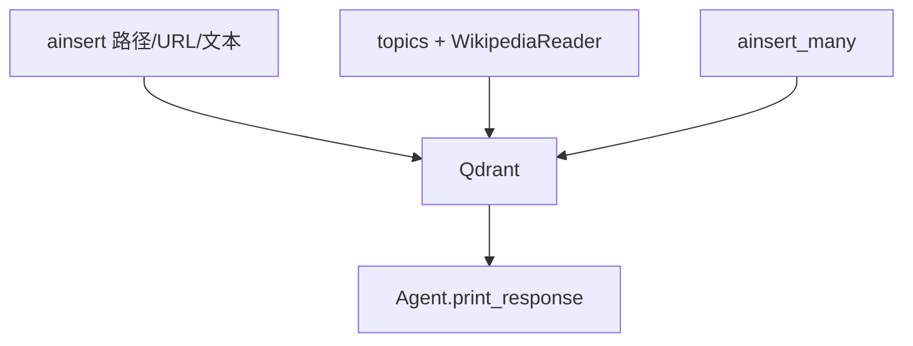

# 03_loading_content.py — 实现原理分析

<!-- cookbook-py-source:start -->
## 完整源码

```python
"""
Loading Content: All Source Types
==================================
Knowledge supports loading content from many sources: local files, URLs,
raw text, topics (Wikipedia/ArXiv), and batch operations.

This example demonstrates each source type. In production, you'll typically
use one or two of these patterns.

Steps:
1. From a local file path
2. From a URL
3. From raw text
4. From topics (Wikipedia, ArXiv)
5. Batch loading from multiple sources

Note: All examples use async methods (ainsert, ainsert_many).
Sync equivalents (insert, insert_many) are also available.
"""

import asyncio

from agno.agent import Agent
from agno.knowledge.embedder.openai import OpenAIEmbedder
from agno.knowledge.knowledge import Knowledge
from agno.knowledge.reader.wikipedia_reader import WikipediaReader

# Also available: from agno.knowledge.reader.arxiv_reader import ArxivReader
from agno.models.openai import OpenAIResponses
from agno.vectordb.qdrant import Qdrant
from agno.vectordb.search import SearchType

# ---------------------------------------------------------------------------
# Setup
# ---------------------------------------------------------------------------

qdrant_url = "http://localhost:6333"

knowledge = Knowledge(
    vector_db=Qdrant(
        collection="loading_content",
        url=qdrant_url,
        search_type=SearchType.hybrid,
        embedder=OpenAIEmbedder(id="text-embedding-3-small"),
    ),
)

agent = Agent(
    model=OpenAIResponses(id="gpt-5.2"),
    knowledge=knowledge,
    search_knowledge=True,
    markdown=True,
)

# ---------------------------------------------------------------------------
# Run Demo
# ---------------------------------------------------------------------------

if __name__ == "__main__":

    async def main():
        # --- 1. From a local file path ---
        print("\n" + "=" * 60)
        print("SOURCE 1: Local file")
        print("=" * 60 + "\n")

        await knowledge.ainsert(
            name="CV",
            path="cookbook/07_knowledge/testing_resources/cv_1.pdf",
            metadata={"source": "local_file"},
        )

        agent.print_response("What skills does Jordan Mitchell have?", stream=True)

        # --- 2. From a URL ---
        print("\n" + "=" * 60)
        print("SOURCE 2: URL")
        print("=" * 60 + "\n")

        await knowledge.ainsert(
            name="Recipes",
            url="https://agno-public.s3.amazonaws.com/recipes/ThaiRecipes.pdf",
            metadata={"source": "url"},
        )
        agent.print_response("What Thai recipes do you know about?", stream=True)

        # --- 3. From raw text ---
        print("\n" + "=" * 60)
        print("SOURCE 3: Raw text")
        print("=" * 60 + "\n")

        await knowledge.ainsert(
            name="Company Info",
            text_content="Acme Corp was founded in 2020. They build AI tools for developers.",
            metadata={"source": "text"},
        )
        agent.print_response("What does Acme Corp do?", stream=True)

        # --- 4. From topics (Wikipedia + ArXiv) ---
        print("\n" + "=" * 60)
        print("SOURCE 4: Topics (Wikipedia)")
        print("=" * 60 + "\n")

        await knowledge.ainsert(
            topics=["Retrieval-Augmented Generation"],
            reader=WikipediaReader(),
        )
        agent.print_response("What is RAG?", stream=True)

        # --- 5. Batch loading from multiple sources ---
        print("\n" + "=" * 60)
        print("SOURCE 5: Batch loading (insert_many)")
        print("=" * 60 + "\n")

        await knowledge.ainsert_many(
            [
                {
                    "name": "Doc 1",
                    "text_content": "Python is a programming language.",
                    "metadata": {"topic": "programming"},
                },
                {
                    "name": "Doc 2",
                    "text_content": "TypeScript adds types to JavaScript.",
                    "metadata": {"topic": "programming"},
                },
            ]
        )
        agent.print_response("Compare Python and TypeScript", stream=True)

    asyncio.run(main())
```

<!-- cookbook-py-source:end -->

> 源文件：`cookbook/07_knowledge/01_getting_started/03_loading_content.py`

## 概述

本示例展示 Agno **Knowledge 内容加载 API 全景**：本地路径、`url`、`text_content`、`topics`+`WikipediaReader`、`ainsert_many` 批量；全部使用 **异步** `ainsert` / `ainsert_many`（同步 `insert` 亦存在）。

**核心配置一览：**

| 配置项 | 值 | 说明 |
|--------|------|------|
| `knowledge` | Qdrant + hybrid + OpenAIEmbedder | 向量库 |
| `agent` | `OpenAIResponses`, `search_knowledge=True` | Agentic 检索 |
| `reader` | `WikipediaReader()` | topic 加载 |

## 架构分层

`ainsert*` 写入向量与内容库 → Agent 通过工具或上下文消费；本文件 **演示加载**，非存储后端选型。

## 核心组件解析

### 五种来源

1. 本地 PDF 路径  
2. URL PDF  
3. 原始文本  
4. Wikipedia topics  
5. `ainsert_many` 多文档  

### 运行机制与因果链

1. **副作用**：重复运行可能重复写入，除非配合 `skip_if_exists`（本文件未统一使用）。
2. **定位**：**ingest 管道参考**，与 RAG 策略正交。

## System Prompt 组装

同 `02_agentic_rag`：无自定义长 `instructions`；`search_knowledge=True` 走 `build_context` 检索说明。

## 完整 API 请求

模型调用：`OpenAIResponses` → `responses.create`（`responses.py` L691+）。

## Mermaid 流程图



## 关键源码文件索引

| 文件 | 作用 |
|------|------|
| `agno/knowledge/knowledge.py` | `ainsert`, `ainsert_many` |
| `agno/knowledge/reader/wikipedia_reader.py` | `WikipediaReader` |
