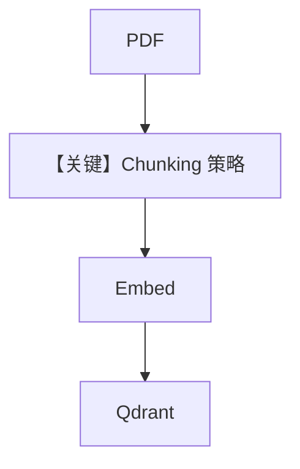

# 01_chunking_strategies.py — 实现原理分析

> 源文件：`cookbook/07_knowledge/02_building_blocks/01_chunking_strategies.py`

## 概述

本示例展示 Agno **切块策略对比**：`PDFReader` 通过 `chunking_strategy` 接入 `FixedSizeChunking`、`RecursiveChunking`、`SemanticChunking`、`DocumentChunking`、`MarkdownChunking`、`AgenticChunking` 等；切块影响嵌入粒度与检索质量，不改变 Agent 消息组装主路径。

**核心配置一览：**

| 配置项 | 值 | 说明 |
|--------|------|------|
| `create_knowledge(table_name)` | 每策略独立 `Knowledge` + Qdrant collection | 隔离实验 |
| `PDFReader` | 多种 `chunking_strategy` | 读 PDF 时切块 |
| `AgenticChunking` | `model=OpenAIResponses(gpt-5.2)` | 需额外 LLM 调用 |

## 架构分层

`ainsert` → Reader 解析 PDF → Chunking 切分 → Embedder 向量 → Qdrant；之后 Agent 与 `02_agentic_rag` 相同。

## 核心组件解析

### 策略选择

- **Fixed**：实现简单，块大小可控。  
- **Recursive**：优先自然边界。  
- **Semantic**：需 embedder，语义聚类。  
- **Agentic**：最慢，边界由模型决定。

### 运行机制与因果链

切块只影响 **索引阶段**；回答阶段仍由 `OpenAIResponses` + `search_knowledge` 行为决定。

## System Prompt 组装

与标准 Agentic RAG 相同；本文件侧重 **数据管道**，非提示词技巧。

## 完整 API 请求

对话：`responses.create`（`responses.py` L691+）。**AgenticChunking** 在索引阶段额外调用模型，与对话模型调用相互独立。

## Mermaid 流程图

## 关键源码文件索引

| 文件 | 作用 |
|------|------|
| `agno/knowledge/chunking/*` | 各策略类 |
| `agno/knowledge/reader/pdf_reader.py` | `PDFReader` |
