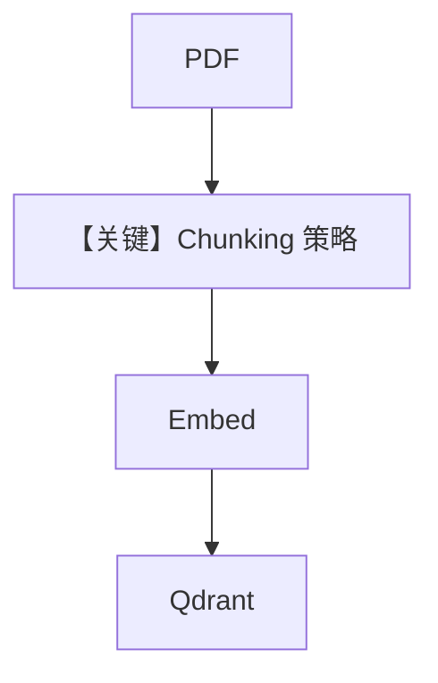

# 01_chunking_strategies.py — 实现原理分析

<!-- cookbook-py-source:start -->
## 完整源码

```python
"""
Chunking Strategies: Side-by-Side Comparison
==============================================
Chunking determines how documents are split into pieces for embedding and search.
The right strategy depends on your content type.

Strategies compared:
- Fixed size: Simple, predictable chunk sizes. Good default.
- Recursive: Splits on natural boundaries (paragraphs, sentences). Better quality.
- Semantic: Groups related sentences by meaning. Best for mixed-topic docs.
- Document: Splits on document structure (pages, sections).
- Markdown: Splits on headers. Ideal for structured documentation.
- Code: Respects function/class boundaries. Use for source code.
- Agentic: LLM determines optimal boundaries. Most accurate, slowest.

See also: ../reference/chunking_decision_guide.md
"""

import asyncio

from agno.agent import Agent
from agno.knowledge.chunking.agentic import AgenticChunking
from agno.knowledge.chunking.document import DocumentChunking
from agno.knowledge.chunking.fixed import FixedSizeChunking
from agno.knowledge.chunking.markdown import MarkdownChunking
from agno.knowledge.chunking.recursive import RecursiveChunking
from agno.knowledge.chunking.semantic import SemanticChunking
from agno.knowledge.embedder.openai import OpenAIEmbedder
from agno.knowledge.knowledge import Knowledge
from agno.knowledge.reader.pdf_reader import PDFReader
from agno.models.openai import OpenAIResponses
from agno.vectordb.qdrant import Qdrant
from agno.vectordb.search import SearchType

# ---------------------------------------------------------------------------
# Setup
# ---------------------------------------------------------------------------

qdrant_url = "http://localhost:6333"
pdf_url = "https://agno-public.s3.amazonaws.com/recipes/ThaiRecipes.pdf"


def create_knowledge(table_name: str) -> Knowledge:
    return Knowledge(
        vector_db=Qdrant(
            collection=table_name,
            url=qdrant_url,
            search_type=SearchType.hybrid,
            embedder=OpenAIEmbedder(id="text-embedding-3-small"),
        ),
    )


# ---------------------------------------------------------------------------
# Chunking Strategies
# ---------------------------------------------------------------------------

# 1. Fixed size: chunks of a set number of characters
fixed_reader = PDFReader(chunking_strategy=FixedSizeChunking(chunk_size=500))

# 2. Recursive: splits on paragraphs, then sentences, then characters
recursive_reader = PDFReader(chunking_strategy=RecursiveChunking(chunk_size=500))

# 3. Semantic: groups sentences by semantic similarity
semantic_reader = PDFReader(
    chunking_strategy=SemanticChunking(
        embedder=OpenAIEmbedder(id="text-embedding-3-small"),
    )
)

# 4. Document: splits on document structure (pages)
document_reader = PDFReader(chunking_strategy=DocumentChunking())

# 5. Markdown: splits on headers (for markdown/docs content)
markdown_reader = PDFReader(chunking_strategy=MarkdownChunking())

# 6. Agentic: LLM decides where to split (slowest, most accurate)
agentic_reader = PDFReader(
    chunking_strategy=AgenticChunking(
        model=OpenAIResponses(id="gpt-5.2"),
    )
)

# ---------------------------------------------------------------------------
# Run Demo
# ---------------------------------------------------------------------------

if __name__ == "__main__":

    async def main():
        strategies = [
            ("fixed_chunking", "Fixed Size", fixed_reader),
            ("recursive_chunking", "Recursive", recursive_reader),
            ("semantic_chunking", "Semantic", semantic_reader),
            ("document_chunking", "Document", document_reader),
        ]

        for table_name, name, reader in strategies:
            print("\n" + "=" * 60)
            print("STRATEGY: %s" % name)
            print("=" * 60 + "\n")

            knowledge = create_knowledge(table_name)
            await knowledge.ainsert(url=pdf_url, reader=reader)

            agent = Agent(
                model=OpenAIResponses(id="gpt-5.2"),
                knowledge=knowledge,
                search_knowledge=True,
                markdown=True,
            )
            agent.print_response(
                "How do I make pad thai?",
                stream=True,
            )

    asyncio.run(main())
```

<!-- cookbook-py-source:end -->

> 源文件：`cookbook/07_knowledge/02_building_blocks/01_chunking_strategies.py`

## 概述

本示例展示 Agno **切块策略对比**：`PDFReader` 通过 `chunking_strategy` 接入 `FixedSizeChunking`、`RecursiveChunking`、`SemanticChunking`、`DocumentChunking`、`MarkdownChunking`、`AgenticChunking` 等；切块影响嵌入粒度与检索质量，不改变 Agent 消息组装主路径。

**核心配置一览：**

| 配置项 | 值 | 说明 |
|--------|------|------|
| `create_knowledge(table_name)` | 每策略独立 `Knowledge` + Qdrant collection | 隔离实验 |
| `PDFReader` | 多种 `chunking_strategy` | 读 PDF 时切块 |
| `AgenticChunking` | `model=OpenAIResponses(gpt-5.2)` | 需额外 LLM 调用 |

## 架构分层

`ainsert` → Reader 解析 PDF → Chunking 切分 → Embedder 向量 → Qdrant；之后 Agent 与 `02_agentic_rag` 相同。

## 核心组件解析

### 策略选择

- **Fixed**：实现简单，块大小可控。  
- **Recursive**：优先自然边界。  
- **Semantic**：需 embedder，语义聚类。  
- **Agentic**：最慢，边界由模型决定。

### 运行机制与因果链

切块只影响 **索引阶段**；回答阶段仍由 `OpenAIResponses` + `search_knowledge` 行为决定。

## System Prompt 组装

与标准 Agentic RAG 相同；本文件侧重 **数据管道**，非提示词技巧。

## 完整 API 请求

对话：`responses.create`（`responses.py` L691+）。**AgenticChunking** 在索引阶段额外调用模型，与对话模型调用相互独立。

## Mermaid 流程图



## 关键源码文件索引

| 文件 | 作用 |
|------|------|
| `agno/knowledge/chunking/*` | 各策略类 |
| `agno/knowledge/reader/pdf_reader.py` | `PDFReader` |
