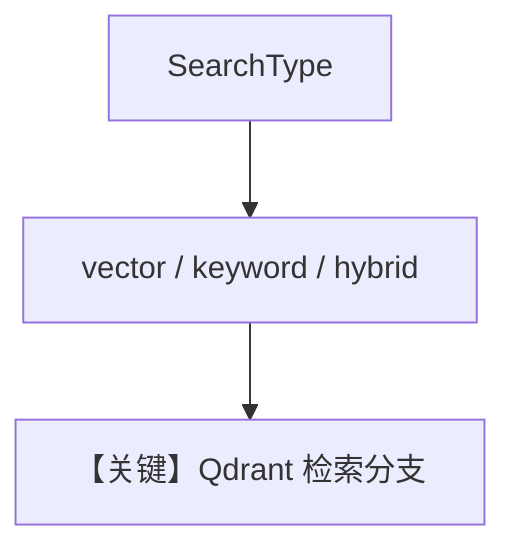

# 02_hybrid_search.py — 实现原理分析

<!-- cookbook-py-source:start -->
## 完整源码

```python
"""
Search Types: Vector, Keyword, and Hybrid
===========================================
Knowledge supports three search types. Each has different strengths:

- Vector: Semantic similarity search. Finds conceptually related content
  even when exact words don't match.
- Keyword: Full-text search. Fast and precise for exact term matching.
- Hybrid: Combines vector + keyword. Best of both worlds. Recommended default.

See also: 03_reranking.py for improving search results with reranking.
"""

import asyncio

from agno.agent import Agent
from agno.knowledge.embedder.openai import OpenAIEmbedder
from agno.knowledge.knowledge import Knowledge
from agno.models.openai import OpenAIResponses
from agno.vectordb.qdrant import Qdrant
from agno.vectordb.search import SearchType

# ---------------------------------------------------------------------------
# Setup
# ---------------------------------------------------------------------------

qdrant_url = "http://localhost:6333"
pdf_url = "https://agno-public.s3.amazonaws.com/recipes/ThaiRecipes.pdf"


def create_knowledge(search_type: SearchType) -> Knowledge:
    return Knowledge(
        vector_db=Qdrant(
            collection="search_types_%s" % search_type.value,
            url=qdrant_url,
            search_type=search_type,
            embedder=OpenAIEmbedder(id="text-embedding-3-small"),
        ),
    )


# ---------------------------------------------------------------------------
# Run Demo
# ---------------------------------------------------------------------------

if __name__ == "__main__":

    async def main():
        search_types = [
            (SearchType.vector, "Vector (semantic similarity)"),
            (SearchType.keyword, "Keyword (full-text search)"),
            (SearchType.hybrid, "Hybrid (vector + keyword)"),
        ]

        for search_type, description in search_types:
            print("\n" + "=" * 60)
            print("SEARCH TYPE: %s" % description)
            print("=" * 60 + "\n")

            knowledge = create_knowledge(search_type)
            # skip_if_exists=True avoids re-processing if run multiple times
            await knowledge.ainsert(url=pdf_url, skip_if_exists=True)

            agent = Agent(
                model=OpenAIResponses(id="gpt-5.2"),
                knowledge=knowledge,
                search_knowledge=True,
                markdown=True,
            )
            agent.print_response(
                "How do I make pad thai?",
                stream=True,
            )

    asyncio.run(main())
```

<!-- cookbook-py-source:end -->

> 源文件：`cookbook/07_knowledge/02_building_blocks/02_hybrid_search.py`

## 概述

本示例展示 Agno **`SearchType` 三模式**：`vector`（语义）、`keyword`（全文）、`hybrid`（向量+关键词融合）；同一 PDF 用不同 `collection` 名隔离实验，`skip_if_exists=True` 避免重复 ingest。

**核心配置一览：**

| 配置项 | 值 | 说明 |
|--------|------|------|
| `create_knowledge(search_type)` | `Qdrant(..., search_type=search_type)` | 枚举驱动 |
| `agent` | `OpenAIResponses`, `search_knowledge=True` | 每轮新建 Agent |

## 核心组件解析

### 三种 SearchType

- **vector**：纯语义。  
- **keyword**：字面匹配强。  
- **hybrid**：默认推荐，兼顾同义与精确词。

## 运行机制与因果链

检索行为在 **向量库适配器** 内分支；Agent 侧接口不变。

## System Prompt 组装

无额外静态文案；遵循默认 Agentic 知识说明。

## 完整 API 请求

`OpenAIResponses.invoke` → `responses.create`（`responses.py` L691+）。

## Mermaid 流程图



## 关键源码文件索引

| 文件 | 作用 |
|------|------|
| `agno/vectordb/search.py` | `SearchType` |
| `agno/vectordb/qdrant` | `Qdrant` 实现 |
