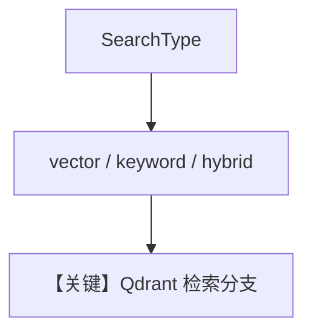

# 02_hybrid_search.py — 实现原理分析

> 源文件：`cookbook/07_knowledge/02_building_blocks/02_hybrid_search.py`

## 概述

本示例展示 Agno **`SearchType` 三模式**：`vector`（语义）、`keyword`（全文）、`hybrid`（向量+关键词融合）；同一 PDF 用不同 `collection` 名隔离实验，`skip_if_exists=True` 避免重复 ingest。

**核心配置一览：**

| 配置项 | 值 | 说明 |
|--------|------|------|
| `create_knowledge(search_type)` | `Qdrant(..., search_type=search_type)` | 枚举驱动 |
| `agent` | `OpenAIResponses`, `search_knowledge=True` | 每轮新建 Agent |

## 核心组件解析

### 三种 SearchType

- **vector**：纯语义。  
- **keyword**：字面匹配强。  
- **hybrid**：默认推荐，兼顾同义与精确词。

## 运行机制与因果链

检索行为在 **向量库适配器** 内分支；Agent 侧接口不变。

## System Prompt 组装

无额外静态文案；遵循默认 Agentic 知识说明。

## 完整 API 请求

`OpenAIResponses.invoke` → `responses.create`（`responses.py` L691+）。

## Mermaid 流程图

## 关键源码文件索引

| 文件 | 作用 |
|------|------|
| `agno/vectordb/search.py` | `SearchType` |
| `agno/vectordb/qdrant` | `Qdrant` 实现 |
