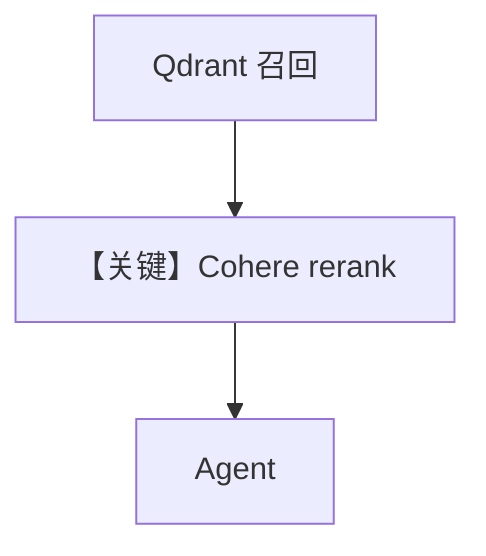

# 03_reranking.py — 实现原理分析

> 源文件：`cookbook/07_knowledge/02_building_blocks/03_reranking.py`

## 概述

本示例展示 **两阶段检索 + Cohere Reranker**：`Qdrant` 构造传入 `reranker=CohereReranker(model="rerank-multilingual-v3.0")`，先召回再重排；Agent 侧增加显式 `instructions` 要求先搜索并引用来源。

**核心配置一览：**

| 配置项 | 值 | 说明 |
|--------|------|------|
| `knowledge` | hybrid + `CohereReranker` | 重排器 |
| `instructions` | 两条：先搜知识库、含来源 | 行为约束 |
| `model` | `OpenAIResponses(gpt-5.2)` | Responses |

## 架构分层

检索管道：向量/混合召回 → Cohere 重排 → 进入工具结果或上下文 → LLM。

## System Prompt 组装

### 还原后的完整 System 文本（instructions 列表）

```text
Always search your knowledge base before answering.
Include sources in your response.
```

（另含默认 markdown 与 `build_context` 检索说明等。）

## 完整 API 请求

- **对话**：`responses.create`（`responses.py` L691+）。  
- **重排**：Cohere API（由 `CohereReranker` 发起，独立于 OpenAI）。

## Mermaid 流程图



## 关键源码文件索引

| 文件 | 作用 |
|------|------|
| `agno/knowledge/reranker/cohere.py` | `CohereReranker` |
