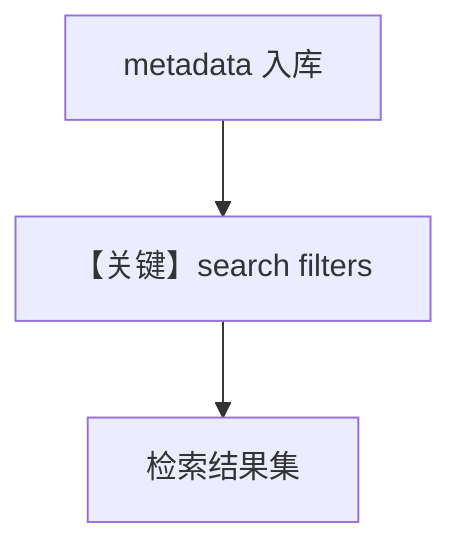

# 04_filtering.py — 实现原理分析

> 源文件：`cookbook/07_knowledge/02_building_blocks/04_filtering.py`

## 概述

本示例展示 **元数据过滤**：加载阶段 `metadata={...}` 打标；查询阶段使用 **dict 过滤器** 或 **`FilterExpr`（AND/OR/NOT 等）** 缩小检索范围，与 `agno.filters` 一致。

**核心配置一览：**

| 配置项 | 值 | 说明 |
|--------|------|------|
| `knowledge` | Qdrant hybrid | 基础 |
| `agent` | `OpenAIResponses`, `search_knowledge=True` | 可带 `knowledge_filters`（见源码后半） |

## 核心组件解析

### 两阶段

1. **On load**：`ainsert(..., metadata=...)`  
2. **On search**：`get_relevant_docs` / 工具路径传 `filters`

## System Prompt 组装

无特殊静态 instructions；过滤为 **检索参数**，不改变 system 模板结构。

## 完整 API 请求

`responses.create`；过滤器进入检索层而非 HTTP body 字面量。

## Mermaid 流程图

## 关键源码文件索引

| 文件 | 作用 |
|------|------|
| `agno/filters` | `AND`, `EQ`, ... |
| `agno/knowledge/knowledge.py` | 检索 API |
