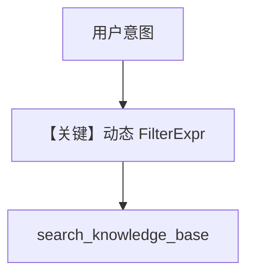

# 05_agentic_filtering.py — 实现原理分析

<!-- cookbook-py-source:start -->
## 完整源码

```python
"""
Agentic Filtering: Agent-Driven Search Refinement
===================================================
With agentic filtering enabled, the agent inspects available metadata keys
in the knowledge base and dynamically builds filters from the user query.

This is powerful for multi-topic knowledge bases where the user's intent
determines which subset of data to search.

Steps:
1. Load documents with metadata tags
2. Enable agentic filtering on the agent
3. The agent automatically builds filters from user queries

See also: 04_filtering.py for static (predefined) filters.
"""

import asyncio

from agno.agent import Agent
from agno.knowledge.embedder.openai import OpenAIEmbedder
from agno.knowledge.knowledge import Knowledge
from agno.models.openai import OpenAIResponses
from agno.vectordb.qdrant import Qdrant
from agno.vectordb.search import SearchType

# ---------------------------------------------------------------------------
# Setup
# ---------------------------------------------------------------------------

qdrant_url = "http://localhost:6333"

knowledge = Knowledge(
    vector_db=Qdrant(
        collection="agentic_filtering_demo",
        url=qdrant_url,
        search_type=SearchType.hybrid,
        embedder=OpenAIEmbedder(id="text-embedding-3-small"),
    ),
)

# ---------------------------------------------------------------------------
# Create Agent
# ---------------------------------------------------------------------------

# Enable agentic filtering: the agent inspects metadata keys and dynamically
# builds filters based on the user's query.
agent = Agent(
    model=OpenAIResponses(id="gpt-5.2"),
    knowledge=knowledge,
    search_knowledge=True,
    enable_agentic_knowledge_filters=True,
    markdown=True,
)

# ---------------------------------------------------------------------------
# Run Demo
# ---------------------------------------------------------------------------

if __name__ == "__main__":

    async def main():
        # Load documents with rich metadata
        await knowledge.ainsert(
            name="Thai Recipes",
            url="https://agno-public.s3.amazonaws.com/recipes/ThaiRecipes.pdf",
            metadata={"cuisine": "thai", "category": "recipes"},
        )
        await knowledge.ainsert(
            name="CV",
            path="cookbook/07_knowledge/testing_resources/cv_1.pdf",
            metadata={"category": "resume", "department": "engineering"},
        )

        print("\n" + "=" * 60)
        print("Agentic filtering: agent builds filters from query")
        print("=" * 60 + "\n")

        # The agent will automatically filter by cuisine=thai
        agent.print_response("What Thai recipes do you have?", stream=True)

        print("\n" + "=" * 60)
        print("Different query triggers different filters")
        print("=" * 60 + "\n")

        # The agent will automatically filter by category=resume
        agent.print_response("What engineering candidates do you have?", stream=True)

    asyncio.run(main())
```

<!-- cookbook-py-source:end -->

> 源文件：`cookbook/07_knowledge/02_building_blocks/05_agentic_filtering.py`

## 概述

本示例展示 **`enable_agentic_knowledge_filters=True`**：由模型根据用户意图与可用元数据键 **动态构造过滤器**，适合多主题混合库；与 `04_filtering` 的手写过滤器相对。

**核心配置一览：**

| 配置项 | 值 | 说明 |
|--------|------|------|
| `enable_agentic_knowledge_filters` | `True` | 动态过滤 |
| `search_knowledge` | `True` | 工具检索 |
| `knowledge` | Qdrant hybrid | 向量库 |

## 核心组件解析

`build_context` 与 agentic filters 在 `_messages.py` 中协同（约 L414–416 `enable_agentic_filters=...`）。

## 运行机制与因果链

模型可能先读元数据键再发带 filter 的搜索，减少无关文档。

## System Prompt 组装

含知识库检索指引；具体附加长度依 `Knowledge.build_context` 运行时输出。

## 完整 API 请求

`responses.create` + 工具循环。

## Mermaid 流程图



## 关键源码文件索引

| 文件 | 作用 |
|------|------|
| `agno/agent/_messages.py` | `enable_agentic_knowledge_filters` 传参 |
