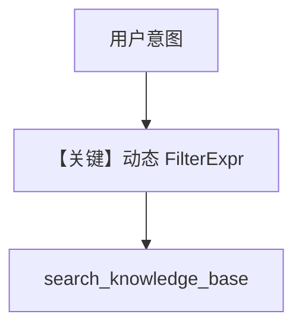

# 05_agentic_filtering.py — 实现原理分析

> 源文件：`cookbook/07_knowledge/02_building_blocks/05_agentic_filtering.py`

## 概述

本示例展示 **`enable_agentic_knowledge_filters=True`**：由模型根据用户意图与可用元数据键 **动态构造过滤器**，适合多主题混合库；与 `04_filtering` 的手写过滤器相对。

**核心配置一览：**

| 配置项 | 值 | 说明 |
|--------|------|------|
| `enable_agentic_knowledge_filters` | `True` | 动态过滤 |
| `search_knowledge` | `True` | 工具检索 |
| `knowledge` | Qdrant hybrid | 向量库 |

## 核心组件解析

`build_context` 与 agentic filters 在 `_messages.py` 中协同（约 L414–416 `enable_agentic_filters=...`）。

## 运行机制与因果链

模型可能先读元数据键再发带 filter 的搜索，减少无关文档。

## System Prompt 组装

含知识库检索指引；具体附加长度依 `Knowledge.build_context` 运行时输出。

## 完整 API 请求

`responses.create` + 工具循环。

## Mermaid 流程图

## 关键源码文件索引

| 文件 | 作用 |
|------|------|
| `agno/agent/_messages.py` | `enable_agentic_knowledge_filters` 传参 |
