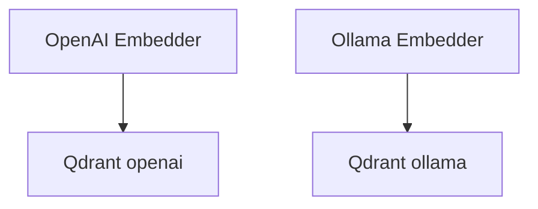

# 06_embedders.py — 实现原理分析

> 源文件：`cookbook/07_knowledge/02_building_blocks/06_embedders.py`

## 概述

本示例对比 **OpenAIEmbedder（云端）** 与 **OllamaEmbedder（本地）**：嵌入模型决定向量语义空间；切换 embedder 需使用 **独立 collection** 以免维度/空间混用。

**核心配置一览：**

| 配置项 | 值 | 说明 |
|--------|------|------|
| `OpenAIEmbedder` | `text-embedding-3-small` | 默认云 |
| `OllamaEmbedder` | `nomic-embed-text`（需本地 ollama） | 隐私/离线 |
| `knowledge_*` | 不同 collection 名 | 隔离实验 |

## 架构分层

嵌入仅影响 **索引与查询向量**；对话仍走 `OpenAIResponses`。

## 核心组件解析

### 运行时分支

Ollama 路径 `try/except`：未安装则跳过，避免 demo 崩溃。

## System Prompt 组装

与常规 Agentic RAG 相同。

## 完整 API 请求

- 对话：`responses.create`。  
- 嵌入：OpenAI Embeddings API 或 Ollama HTTP（由对应 Embedder 封装）。

## Mermaid 流程图

## 关键源码文件索引

| 文件 | 作用 |
|------|------|
| `agno/knowledge/embedder/openai.py` | `OpenAIEmbedder` |
| `agno/knowledge/embedder/ollama.py` | `OllamaEmbedder` |
