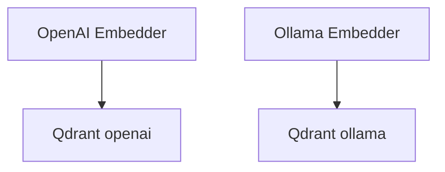

# 06_embedders.py — 实现原理分析

<!-- cookbook-py-source:start -->
## 完整源码

```python
"""
Embedders: Choosing and Configuring Embedding Models
=====================================================
Embedders convert text into vectors for semantic search. The choice of
embedder affects search quality, cost, and privacy.

This example shows two common configurations:
1. OpenAI (cloud, recommended default)
2. Ollama (local, private, no API calls)

For a full comparison of all 17+ supported providers, see:
    ../reference/embedder_comparison.md
"""

import asyncio

from agno.agent import Agent
from agno.knowledge.embedder.openai import OpenAIEmbedder
from agno.knowledge.knowledge import Knowledge
from agno.models.openai import OpenAIResponses
from agno.vectordb.qdrant import Qdrant
from agno.vectordb.search import SearchType

# ---------------------------------------------------------------------------
# Setup
# ---------------------------------------------------------------------------

qdrant_url = "http://localhost:6333"
pdf_url = "https://agno-public.s3.amazonaws.com/recipes/ThaiRecipes.pdf"

# ---------------------------------------------------------------------------
# Run Demo
# ---------------------------------------------------------------------------

if __name__ == "__main__":

    async def main():
        # --- 1. OpenAI embedder (cloud, recommended default) ---
        print("\n" + "=" * 60)
        print("EMBEDDER 1: OpenAI text-embedding-3-small")
        print("=" * 60 + "\n")

        knowledge_openai = Knowledge(
            vector_db=Qdrant(
                collection="embedder_openai",
                url=qdrant_url,
                search_type=SearchType.hybrid,
                embedder=OpenAIEmbedder(id="text-embedding-3-small"),
            ),
        )
        await knowledge_openai.ainsert(url=pdf_url, skip_if_exists=True)

        agent_openai = Agent(
            model=OpenAIResponses(id="gpt-5.2"),
            knowledge=knowledge_openai,
            search_knowledge=True,
            markdown=True,
        )
        agent_openai.print_response("How do I make pad thai?", stream=True)

        # --- 2. Ollama embedder (local, private) ---
        # Requires: ollama pull nomic-embed-text
        print("\n" + "=" * 60)
        print("EMBEDDER 2: Ollama nomic-embed-text (local)")
        print("=" * 60 + "\n")

        try:
            from agno.knowledge.embedder.ollama import OllamaEmbedder

            knowledge_ollama = Knowledge(
                vector_db=Qdrant(
                    collection="embedder_ollama",
                    url=qdrant_url,
                    search_type=SearchType.hybrid,
                    embedder=OllamaEmbedder(
                        id="nomic-embed-text",
                        dimensions=768,
                    ),
                ),
            )
            await knowledge_ollama.ainsert(url=pdf_url, skip_if_exists=True)

            agent_ollama = Agent(
                model=OpenAIResponses(id="gpt-5.2"),
                knowledge=knowledge_ollama,
                search_knowledge=True,
                markdown=True,
            )
            agent_ollama.print_response("How do I make pad thai?", stream=True)

        except ImportError:
            print("Ollama not installed. Run: pip install ollama")
        except Exception as e:
            print("Ollama embedder failed (is Ollama running?): %s" % e)

    asyncio.run(main())
```

<!-- cookbook-py-source:end -->

> 源文件：`cookbook/07_knowledge/02_building_blocks/06_embedders.py`

## 概述

本示例对比 **OpenAIEmbedder（云端）** 与 **OllamaEmbedder（本地）**：嵌入模型决定向量语义空间；切换 embedder 需使用 **独立 collection** 以免维度/空间混用。

**核心配置一览：**

| 配置项 | 值 | 说明 |
|--------|------|------|
| `OpenAIEmbedder` | `text-embedding-3-small` | 默认云 |
| `OllamaEmbedder` | `nomic-embed-text`（需本地 ollama） | 隐私/离线 |
| `knowledge_*` | 不同 collection 名 | 隔离实验 |

## 架构分层

嵌入仅影响 **索引与查询向量**；对话仍走 `OpenAIResponses`。

## 核心组件解析

### 运行时分支

Ollama 路径 `try/except`：未安装则跳过，避免 demo 崩溃。

## System Prompt 组装

与常规 Agentic RAG 相同。

## 完整 API 请求

- 对话：`responses.create`。  
- 嵌入：OpenAI Embeddings API 或 Ollama HTTP（由对应 Embedder 封装）。

## Mermaid 流程图



## 关键源码文件索引

| 文件 | 作用 |
|------|------|
| `agno/knowledge/embedder/openai.py` | `OpenAIEmbedder` |
| `agno/knowledge/embedder/ollama.py` | `OllamaEmbedder` |
