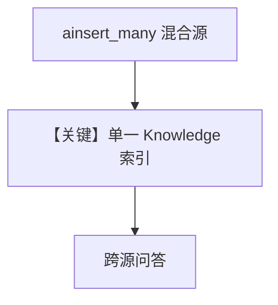

# 01_multi_source_rag.py — 实现原理分析

> 源文件：`cookbook/07_knowledge/03_production/01_multi_source_rag.py`

## 概述

本示例展示 **多源批量入库**：`ainsert_many` 一次混合 `path`（本地 PDF）、`url`、`text_content`，并带 `metadata` 区分来源；单一 `Knowledge` 与 `Agent` 跨源问答，贴近生产多文档场景。

**核心配置一览：**

| 配置项 | 值 | 说明 |
|--------|------|------|
| `knowledge` | Qdrant `multi_source_rag` | 统一集合 |
| `agent` | `OpenAIResponses`, `search_knowledge=True` | Agentic |
| `ainsert_many` | 三条记录，字段各异 | 批量 |

## 架构分层

所有内容进入同一向量索引，依赖 **metadata + 过滤/agentic** 做子集检索（本文件演示加载，过滤可参考 `04`/`05`）。

## 运行机制与因果链

1. **路径**：批量入库 → 用户问简历技能 / 问报销政策 → 模型检索相应块。  
2. **定位**：**生产多源 RAG 数据模型** 的最小示例。

## System Prompt 组装

默认 Agentic 知识说明 + `markdown`；无额外长 `instructions`。

## 完整 API 请求

`responses.create`（`responses.py` L691+）。

## Mermaid 流程图

## 关键源码文件索引

| 文件 | 作用 |
|------|------|
| `agno/knowledge/knowledge.py` | `ainsert_many` |
| `agno/models/openai/responses.py` | `invoke` |
