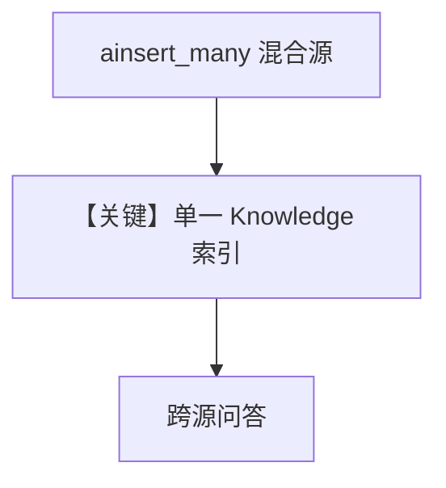

# 01_multi_source_rag.py — 实现原理分析

<!-- cookbook-py-source:start -->
## 完整源码

```python
"""
Multi-Source RAG: Combining Different Content Types
====================================================
In production, agents often need knowledge from multiple sources:
PDFs, web pages, text snippets, and databases.

This example loads content from different source types into the same
knowledge base, demonstrating insert_many with mixed sources.

See also: 02_knowledge_lifecycle.py for managing content over time.
"""

import asyncio

from agno.agent import Agent
from agno.knowledge.embedder.openai import OpenAIEmbedder
from agno.knowledge.knowledge import Knowledge
from agno.models.openai import OpenAIResponses
from agno.vectordb.qdrant import Qdrant
from agno.vectordb.search import SearchType

# ---------------------------------------------------------------------------
# Setup
# ---------------------------------------------------------------------------

qdrant_url = "http://localhost:6333"

knowledge = Knowledge(
    vector_db=Qdrant(
        collection="multi_source_rag",
        url=qdrant_url,
        search_type=SearchType.hybrid,
        embedder=OpenAIEmbedder(id="text-embedding-3-small"),
    ),
)

agent = Agent(
    model=OpenAIResponses(id="gpt-5.2"),
    knowledge=knowledge,
    search_knowledge=True,
    markdown=True,
)

# ---------------------------------------------------------------------------
# Run Demo
# ---------------------------------------------------------------------------

if __name__ == "__main__":

    async def main():
        # Load multiple sources in a single batch call
        await knowledge.ainsert_many(
            [
                {
                    "name": "Candidate Resume",
                    "path": "cookbook/07_knowledge/testing_resources/cv_1.pdf",
                    "metadata": {"source": "resume", "department": "engineering"},
                },
                {
                    "name": "Thai Recipes",
                    "url": "https://agno-public.s3.amazonaws.com/recipes/ThaiRecipes.pdf",
                    "metadata": {"source": "web", "topic": "cooking"},
                },
                {
                    "name": "Company Policy",
                    "text_content": "All employees must complete security training annually. "
                    "Remote work requires VPN access. Expenses over $500 need manager approval.",
                    "metadata": {"source": "internal", "topic": "policy"},
                },
            ]
        )

        print("\n" + "=" * 60)
        print("Query across multiple sources")
        print("=" * 60 + "\n")

        agent.print_response("What skills does Jordan Mitchell have?", stream=True)

        print("\n" + "=" * 60)
        print("Agent searches the same knowledge base for different topics")
        print("=" * 60 + "\n")

        agent.print_response("What is the expense approval policy?", stream=True)

    asyncio.run(main())
```

<!-- cookbook-py-source:end -->

> 源文件：`cookbook/07_knowledge/03_production/01_multi_source_rag.py`

## 概述

本示例展示 **多源批量入库**：`ainsert_many` 一次混合 `path`（本地 PDF）、`url`、`text_content`，并带 `metadata` 区分来源；单一 `Knowledge` 与 `Agent` 跨源问答，贴近生产多文档场景。

**核心配置一览：**

| 配置项 | 值 | 说明 |
|--------|------|------|
| `knowledge` | Qdrant `multi_source_rag` | 统一集合 |
| `agent` | `OpenAIResponses`, `search_knowledge=True` | Agentic |
| `ainsert_many` | 三条记录，字段各异 | 批量 |

## 架构分层

所有内容进入同一向量索引，依赖 **metadata + 过滤/agentic** 做子集检索（本文件演示加载，过滤可参考 `04`/`05`）。

## 运行机制与因果链

1. **路径**：批量入库 → 用户问简历技能 / 问报销政策 → 模型检索相应块。  
2. **定位**：**生产多源 RAG 数据模型** 的最小示例。

## System Prompt 组装

默认 Agentic 知识说明 + `markdown`；无额外长 `instructions`。

## 完整 API 请求

`responses.create`（`responses.py` L691+）。

## Mermaid 流程图



## 关键源码文件索引

| 文件 | 作用 |
|------|------|
| `agno/knowledge/knowledge.py` | `ainsert_many` |
| `agno/models/openai/responses.py` | `invoke` |
