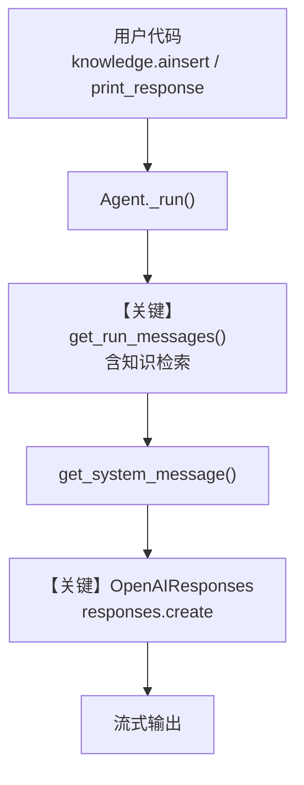

# 02_knowledge_lifecycle.py — 实现原理分析

<!-- cookbook-py-source:start -->
## 完整源码

```python
"""
Knowledge Lifecycle: Insert, Update, Remove, Track
====================================================
In production, knowledge needs to be managed over time:
- Skip re-inserting content that already exists
- Remove outdated content
- Track content status with a contents database
- Re-index when content changes

This example shows the full content lifecycle with a contents database
for tracking what has been ingested and its current status.

See also: 03_multi_tenant.py for isolating knowledge per tenant.
"""

import asyncio

from agno.agent import Agent
from agno.db.sqlite import SqliteDb
from agno.knowledge.embedder.openai import OpenAIEmbedder
from agno.knowledge.knowledge import Knowledge
from agno.models.openai import OpenAIResponses
from agno.vectordb.qdrant import Qdrant
from agno.vectordb.search import SearchType

# ---------------------------------------------------------------------------
# Setup
# ---------------------------------------------------------------------------

qdrant_url = "http://localhost:6333"

knowledge = Knowledge(
    name="Lifecycle Demo",
    vector_db=Qdrant(
        collection="lifecycle_demo",
        url=qdrant_url,
        search_type=SearchType.hybrid,
        embedder=OpenAIEmbedder(id="text-embedding-3-small"),
    ),
    # Contents DB tracks ingested content, status, and metadata
    contents_db=SqliteDb(
        db_file="tmp/agent.db",
    ),
)

agent = Agent(
    model=OpenAIResponses(id="gpt-5.2"),
    knowledge=knowledge,
    search_knowledge=True,
    markdown=True,
)

# ---------------------------------------------------------------------------
# Run Demo
# ---------------------------------------------------------------------------

if __name__ == "__main__":

    async def main():
        # --- 1. Initial insert ---
        print("\n" + "=" * 60)
        print("STEP 1: Initial insert")
        print("=" * 60 + "\n")

        await knowledge.ainsert(
            name="Recipes",
            url="https://agno-public.s3.amazonaws.com/recipes/ThaiRecipes.pdf",
        )
        agent.print_response("What recipes do you know?", stream=True)

        # --- 2. Skip if exists ---
        print("\n" + "=" * 60)
        print("STEP 2: Skip if already exists (no re-processing)")
        print("=" * 60 + "\n")

        await knowledge.ainsert(
            name="Recipes",
            url="https://agno-public.s3.amazonaws.com/recipes/ThaiRecipes.pdf",
            skip_if_exists=True,  # Won't re-process since content hash matches
        )
        print("Content was skipped (already exists)")

        # --- 3. Remove content ---
        print("\n" + "=" * 60)
        print("STEP 3: Remove vectors by name")
        print("=" * 60 + "\n")

        await knowledge.aremove_vectors_by_name("Recipes")
        print("Vectors for 'Recipes' removed from the vector database")

    asyncio.run(main())
```

<!-- cookbook-py-source:end -->

> 源文件：`cookbook/07_knowledge/03_production/02_knowledge_lifecycle.py`

## 概述

本示例展示 Agno 的 **Knowledge 内容生命周期** 机制：通过 `contents_db` 追踪已摄入内容，配合 `ainsert` / `skip_if_exists` / `aremove_vectors_by_name` 完成插入、幂等跳过与按名删除向量，再由 **Agentic RAG**（`search_knowledge=True`）查询。

**核心配置一览：**

| 配置项 | 值 | 说明 |
|--------|------|------|
| `Knowledge.name` | `"Lifecycle Demo"` | 知识库实例名 |
| `Knowledge.vector_db` | `Qdrant(...)` | 混合检索 + OpenAI 嵌入 |
| `Knowledge.contents_db` | `SqliteDb(db_file="tmp/agent.db")` | 内容状态追踪 |
| `Agent.model` | `OpenAIResponses(id="gpt-5.2")` | Responses API |
| `Agent.knowledge` | 上表 `Knowledge` | 绑定知识库 |
| `Agent.search_knowledge` | `True` | 启用检索注入 |
| `Agent.markdown` | `True` | 回答使用 Markdown |
| `description` / `instructions` | `None` | 未设置 |

## 架构分层

```
用户代码层                agno.agent 层
┌────────────────────────┐    ┌──────────────────────────────────┐
│ 02_knowledge_lifecycle│    │ Agent._run() / arun()            │
│ knowledge.ainsert(...)  │───>│  get_system_message()            │
│ agent.print_response()  │    │  get_run_messages()              │
│                         │    │  → 知识检索上下文（search 工具链）│
└────────────────────────┘    └──────────────────────────────────┘
                                      │
                                      ▼
                              ┌──────────────────┐
                              │ OpenAIResponses  │
                              │ gpt-5.2          │
                              └──────────────────┘
```

## 核心组件解析

### Knowledge + contents_db

`contents_db` 与 `vector_db` 配合，记录摄入状态，使 `skip_if_exists` 能基于内容哈希避免重复处理（见源码中 `Knowledge` 与 `SqliteDb` 用法）。

### 生命周期 API

- `ainsert(..., skip_if_exists=True)`：已存在则跳过。
- `aremove_vectors_by_name("Recipes")`：按逻辑名删除向量侧数据。

### 运行机制与因果链

1. **数据路径**：远程 PDF → `knowledge.ainsert` → 嵌入写入 Qdrant + 元数据写入 contents DB → 用户提问 → `Agent.run` → `get_run_messages` 含检索结果 → `OpenAIResponses.invoke` → 流式输出。
2. **状态与副作用**：写入 SQLite contents、Qdrant 向量；重复运行同一 URL 在 `skip_if_exists` 下不重复处理。
3. **关键分支**：`skip_if_exists=False` 时可能重新处理；`aremove_vectors_by_name` 后检索为空集。
4. **与相邻示例差异**：相对 `03_multi_tenant.py` 本示例强调 **contents 追踪 + 删除向量**，非租户隔离。

## System Prompt 组装

| 序号 | 组成部分 | 本文件中的值/来源 | 是否生效 |
|------|---------|------------------|---------|
| 1 | `description` | 未设置 | 否 |
| 2 | `role` | 未设置 | 否 |
| 3 | `instructions` | 未设置 | 否 |
| 4 | `markdown` | `True` | 是 |
| 5 | 默认拼装 | `_messages.py` 3.2.1 / 3.3.x | 是 |

### 拼装顺序与源码锚点

1. 无自定义 `system_message`，`build_context` 默认 True → 走 `get_system_message()`（`agno/agent/_messages.py` L106 起）默认路径。
2. `# 3.2.1`：因 `markdown=True` 且非 `output_schema`，追加 `Use markdown to format your answers.`（约 L184-185）。
3. `# 3.3.1`–`# 3.3.4`：无 `description`/`role`/`instructions` 时，系统消息主要为附加信息与 Markdown 提示。

### 还原后的完整 System 文本

```text
<additional_information>
- Use markdown to format your answers.
</additional_information>
```

（若运行时 `get_system_message` 在 knowledge 路径注入额外工具说明，请以调试 `print(message.content)` 为准；本示例未显式 `instructions`。）

### 段落释义（模型视角）

- Markdown 约束模型用结构化文本回答，便于前端渲染。
- 检索到的文档片段会进入用户/工具消息路径，不由上述静态 system 单独列出。

### 与 User / Developer 消息的边界

`OpenAIResponses` 将 `system` 映射为 `developer`（`responses.py` 中 `role_map`）。用户问题与检索上下文作为后续 `input` 组成部分。

## 完整 API 请求

```python
# OpenAIResponses → client.responses.create（见 agno/models/openai/responses.py 约 L691 / 流式 L832）
client.responses.create(
    model="gpt-5.2",
    input=[
        {"role": "developer", "content": "<上节还原的 system 文本及运行时扩展>"},
        {"role": "user", "content": "What recipes do you know?"},
    ],
    stream=True,
)
```

> 检索内容通过 Agent 消息组装进入 `input`，与第 5 节 developer 内容衔接。

## Mermaid 流程图



- **【关键】get_run_messages**：组装含 RAG 的完整对话输入。
- **【关键】responses.create**：Responses API 单次生成。

## 关键源码文件索引

| 文件 | 关键函数/类 | 作用 |
|------|------------|------|
| `agno/agent/_messages.py` | `get_system_message()` L106+ | 默认 system 拼装 |
| `agno/agent/_messages.py` | `get_run_messages()` | 运行消息与检索 |
| `agno/knowledge/knowledge.py` | `Knowledge.ainsert` / `aremove_vectors_by_name` | 生命周期 |
| `agno/models/openai/responses.py` | `responses.create` L691 等 | Responses 调用 |
