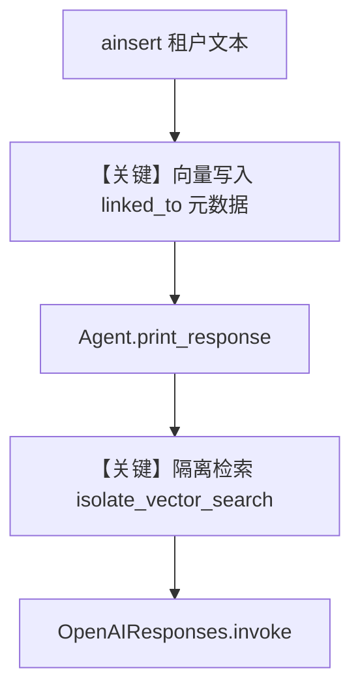

# 03_multi_tenant.py — 实现原理分析

<!-- cookbook-py-source:start -->
## 完整源码

```python
"""
Multi-Tenant Knowledge: Isolating Data Per Tenant
===================================================
When multiple Knowledge instances share the same vector database,
use isolate_vector_search to ensure each instance only searches its own data.

This is essential for multi-tenant applications where different users
or departments should only access their own documents.

Behavior:
- isolate_vector_search=False (default): Searches ALL vectors in the database.
- isolate_vector_search=True: Only searches vectors tagged with this instance's name.

Important: Existing data without linked_to metadata won't be found when
isolation is enabled. You'll need to re-index to add the metadata.

See also: ../02_building_blocks/04_filtering.py for metadata-based filtering.
"""

import asyncio

from agno.agent import Agent
from agno.knowledge.embedder.openai import OpenAIEmbedder
from agno.knowledge.knowledge import Knowledge
from agno.models.openai import OpenAIResponses
from agno.vectordb.qdrant import Qdrant
from agno.vectordb.search import SearchType

# ---------------------------------------------------------------------------
# Setup
# ---------------------------------------------------------------------------

qdrant_url = "http://localhost:6333"

# Both knowledge instances share the same vector collection
vector_db = Qdrant(
    collection="multi_tenant",
    url=qdrant_url,
    search_type=SearchType.hybrid,
    embedder=OpenAIEmbedder(id="text-embedding-3-small"),
)

# Tenant A: only sees its own data
tenant_a_knowledge = Knowledge(
    name="Tenant A",
    vector_db=vector_db,
    isolate_vector_search=True,
)

# Tenant B: only sees its own data
tenant_b_knowledge = Knowledge(
    name="Tenant B",
    vector_db=vector_db,
    isolate_vector_search=True,
)

# ---------------------------------------------------------------------------
# Create Agents
# ---------------------------------------------------------------------------

agent_a = Agent(
    model=OpenAIResponses(id="gpt-5.2"),
    knowledge=tenant_a_knowledge,
    search_knowledge=True,
    markdown=True,
)

agent_b = Agent(
    model=OpenAIResponses(id="gpt-5.2"),
    knowledge=tenant_b_knowledge,
    search_knowledge=True,
    markdown=True,
)

# ---------------------------------------------------------------------------
# Run Demo
# ---------------------------------------------------------------------------

if __name__ == "__main__":

    async def main():
        # Insert different content for each tenant
        await tenant_a_knowledge.ainsert(
            name="Tenant A Docs",
            text_content="Tenant A uses PostgreSQL for their primary database.",
        )
        await tenant_b_knowledge.ainsert(
            name="Tenant B Docs",
            text_content="Tenant B runs their workloads on AWS with DynamoDB.",
        )

        print("\n" + "=" * 60)
        print("TENANT A: Only sees its own data")
        print("=" * 60 + "\n")

        agent_a.print_response("What database do we use?", stream=True)

        print("\n" + "=" * 60)
        print("TENANT B: Only sees its own data")
        print("=" * 60 + "\n")

        agent_b.print_response("What cloud provider do we use?", stream=True)

    asyncio.run(main())
```

<!-- cookbook-py-source:end -->

> 源文件：`cookbook/07_knowledge/03_production/03_multi_tenant.py`

## 概述

本示例展示 Agno 的 **`isolate_vector_search` 多租户知识隔离** 机制：多个 `Knowledge` 共享同一 `Qdrant` collection，但检索时仅命中带本实例 `name` / `linked_to` 元数据的向量，避免跨租户泄露。

**核心配置一览：**

| 配置项 | 值 | 说明 |
|--------|------|------|
| `vector_db` | 共享 `Qdrant(collection="multi_tenant", ...)` | 物理共库 |
| `tenant_a_knowledge` | `Knowledge(name="Tenant A", isolate_vector_search=True)` | 租户 A |
| `tenant_b_knowledge` | `Knowledge(name="Tenant B", isolate_vector_search=True)` | 租户 B |
| `Agent.model` | `OpenAIResponses(id="gpt-5.2")` | 两 Agent 相同 |
| `search_knowledge` | `True` | 启用 RAG |
| `markdown` | `True` | Markdown 输出 |

## 架构分层

```
用户代码                    agno
┌─────────────────────┐     ┌─────────────────────────────┐
│ 共享 Qdrant         │     │ Knowledge.search 带隔离过滤  │
│ 两 Knowledge 实例    │───>│ Agent + get_run_messages     │
└─────────────────────┘     └─────────────────────────────┘
                                      ▼
                            OpenAIResponses(gpt-5.2)
```

## 核心组件解析

### isolate_vector_search

为 `True` 时，向量检索限定在当前 `Knowledge.name` 对应元数据；**旧数据若无 `linked_to` 在开启隔离后不可见**，需重索引（见文件头注释）。

### 运行机制与因果链

1. **路径**：`ainsert` 写入带租户语义的内容 → 查询经隔离过滤的 top-k → 注入上下文 → 模型回答。
2. **副作用**：向量与内容元数据写入共享库；两租户数据共存但检索不交叉。
3. **分支**：`isolate_vector_search=False`（默认）时全库可搜。
4. **差异**：相对 `02_knowledge_lifecycle.py`，本文件突出 **共享基础设施下的逻辑隔离**。

## System Prompt 组装

| 组成部分 | 本文件 | 生效 |
|---------|--------|------|
| `instructions` | 无 | 否 |
| `markdown` | True | 是（3.2.1） |

### 还原后的完整 System 文本

```text
<additional_information>
- Use markdown to format your answers.
</additional_information>
```

### 段落释义

- 模型回答格式受 Markdown 约束；**租户边界由检索层完成**，不由 system 文本描述。

## 完整 API 请求

```python
# 与 OpenAIResponses 一致：responses.create，system→developer
client.responses.create(
    model="gpt-5.2",
    input=[...],  # developer + user，含检索片段
    stream=True,
)
```

## Mermaid 流程图



## 关键源码文件索引

| 文件 | 作用 |
|------|------|
| `agno/knowledge/knowledge.py` | `isolate_vector_search` 检索路径 |
| `agno/agent/_messages.py` | `get_system_message` L106+ |
| `agno/models/openai/responses.py` | `responses.create` |
