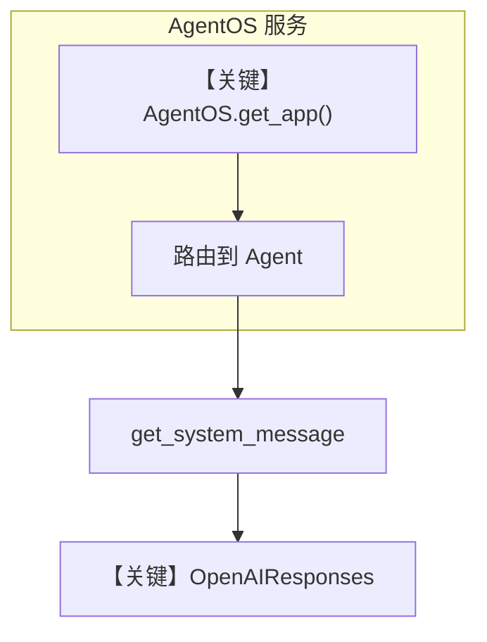

# 04_agent_os.py — 实现原理分析

> 源文件：`cookbook/07_knowledge/03_production/04_agent_os.py`

## 概述

本示例展示 **AgentOS + 多 Knowledge 实例**：`company_knowledge` 与 `product_knowledge` 共享 `vector_db` 与 `contents_db`，通过 `name` / `linked_to` 区分内容；`AgentOS` 暴露 FastAPI 服务与 `/knowledge` 管理能力。

**核心配置一览：**

| 配置项 | 值 | 说明 |
|--------|------|------|
| `company_knowledge` | `Knowledge(name="Company Docs", description=..., ...)` | 内部文档 |
| `product_knowledge` | `Knowledge(name="Product FAQ", ...)` | FAQ |
| `support_agent` | `Agent(name="Support Agent", model=OpenAIResponses(gpt-5.2), knowledge=company_knowledge, search_knowledge=True, markdown=True)` | 支持 |
| `product_agent` | 同上，绑定 `product_knowledge` | 产品 |
| `agent_os` | `AgentOS(agents=[support_agent, product_agent])` | OS 外壳 |
| `serve` | `agent_os.serve(app="04_agent_os:app", reload=True)` | 本地服务 |

## 架构分层

```
用户 / HTTP 客户端
        │
        ▼
   AgentOS.get_app() → FastAPI
        │ 路由到 agents / knowledge API
        ▼
   Agent._run → OpenAIResponses
```

## 核心组件解析

### AgentOS

将多个 Agent 与 Knowledge 注册到同一进程服务，便于从脚本升级为 API 形态（见 `agno/os`）。

### 运行机制与因果链

1. **路径**：HTTP 或脚本侧触发 `run` → 与独立脚本相同的 Agent 消息与模型调用。
2. **状态**：`contents_db` 持久化摄入记录；服务进程内驻留 Agent 实例。
3. **分支**：不同 Agent 绑定不同 `Knowledge`，检索范围不同。
4. **差异**：相对 `03_multi_tenant.py`，本示例强调 **HTTP 服务化** 而非仅租户标志。

## System Prompt 组装

两 Agent 均 `markdown=True`，无额外 `instructions`；`name` 默认不加入 context（`add_name_to_context` 未设）。

### 还原后的完整 System 文本（单 Agent 默认路径）

```text
<additional_information>
- Use markdown to format your answers.
</additional_information>
```

若启用 `add_name_to_context`，则会多出 “Your name is: Support Agent” 等，本文件未启用。

## 完整 API 请求

- **LLM**：`OpenAIResponses` → `responses.create`（`agno/models/openai/responses.py`）。
- **AgentOS HTTP**：由 FastAPI 路由封装对内部 `Agent` 的调用，非直接 OpenAI 裸 HTTP。

## Mermaid 流程图



## 关键源码文件索引

| 文件 | 作用 |
|------|------|
| `agno/os/__init__.py` / `AgentOS` | 应用组装 |
| `agno/agent/_messages.py` | System 与 run 消息 |
| `agno/models/openai/responses.py` | Responses API |
