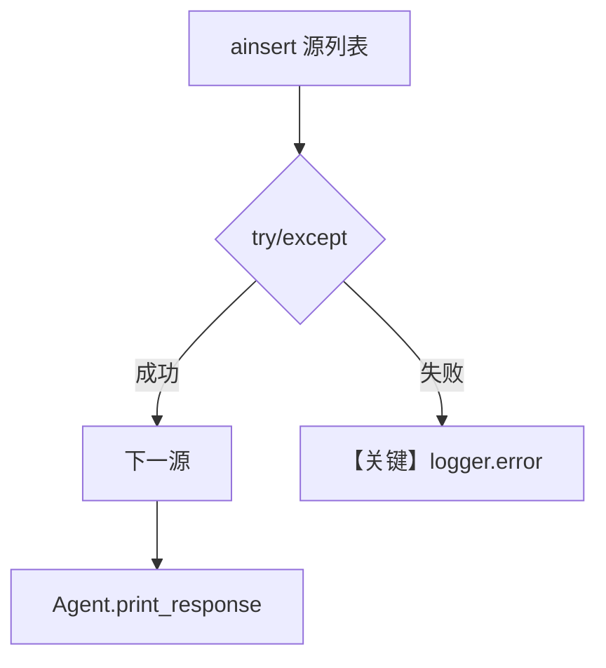

# 04_error_handling.py — 实现原理分析

<!-- cookbook-py-source:start -->
## 完整源码

```python
"""
Error Handling: Production Patterns
=====================================
Production knowledge systems need to handle failures gracefully:
- Content that fails to load
- Vector DB connection issues
- Large document batches with partial failures

This example shows patterns for robust knowledge ingestion.
"""

import asyncio
import logging

from agno.agent import Agent
from agno.knowledge.embedder.openai import OpenAIEmbedder
from agno.knowledge.knowledge import Knowledge
from agno.models.openai import OpenAIResponses
from agno.vectordb.qdrant import Qdrant
from agno.vectordb.search import SearchType

logger = logging.getLogger(__name__)

# ---------------------------------------------------------------------------
# Setup
# ---------------------------------------------------------------------------

qdrant_url = "http://localhost:6333"

knowledge = Knowledge(
    vector_db=Qdrant(
        collection="error_handling_demo",
        url=qdrant_url,
        search_type=SearchType.hybrid,
        embedder=OpenAIEmbedder(id="text-embedding-3-small"),
    ),
)

agent = Agent(
    model=OpenAIResponses(id="gpt-5.2"),
    knowledge=knowledge,
    search_knowledge=True,
    markdown=True,
)

# ---------------------------------------------------------------------------
# Run Demo
# ---------------------------------------------------------------------------

if __name__ == "__main__":

    async def main():
        # --- 1. Safe insert with skip_if_exists ---
        print("\n" + "=" * 60)
        print("PATTERN 1: Idempotent inserts with skip_if_exists")
        print("=" * 60 + "\n")

        # Safe to call multiple times - won't re-process existing content
        await knowledge.ainsert(
            name="Recipes",
            url="https://agno-public.s3.amazonaws.com/recipes/ThaiRecipes.pdf",
            skip_if_exists=True,
        )
        print("Insert completed (skipped if already exists)")

        # --- 2. Batch with mixed valid/invalid sources ---
        print("\n" + "=" * 60)
        print("PATTERN 2: Batch insert with error logging")
        print("=" * 60 + "\n")

        sources = [
            {"name": "Valid", "text_content": "This will succeed."},
            {"name": "Also Valid", "text_content": "This will also succeed."},
        ]

        for source in sources:
            try:
                await knowledge.ainsert(**source)
                print("Inserted: %s" % source["name"])
            except Exception as e:
                logger.error("Failed to insert %s: %s", source["name"], e)

        # --- 3. Verify knowledge is usable ---
        print("\n" + "=" * 60)
        print("PATTERN 3: Verify knowledge after ingestion")
        print("=" * 60 + "\n")

        agent.print_response("What do you know?", stream=True)

    asyncio.run(main())
```

<!-- cookbook-py-source:end -->

> 源文件：`cookbook/07_knowledge/03_production/04_error_handling.py`

## 概述

本示例展示 **生产向知识摄入的错误处理**：`skip_if_exists` 幂等插入、循环内 `try/except` 记录失败、最后通过 Agent 验证知识可用，强调 **日志与部分失败可接受** 的实践。

**核心配置一览：**

| 配置项 | 值 | 说明 |
|--------|------|------|
| `Knowledge.vector_db` | `Qdrant(..., hybrid)` | 向量库 |
| `Agent.model` | `OpenAIResponses(id="gpt-5.2")` | Responses |
| `search_knowledge` | `True` | RAG |
| `markdown` | `True` | Markdown |
| `contents_db` | 无 | 未设置 |

## 架构分层

```
logging + knowledge.ainsert (try/except)
              │
              ▼
        Agent.print_response → OpenAIResponses
```

## 核心组件解析

### 模式 1：skip_if_exists

避免重复拉取/嵌入已有内容，降低失败面与费用。

### 模式 2：批量源循环

单条失败记录日志，不阻断后续源（业务上可扩展为重试队列）。

### 运行机制与因果链

1. **路径**：ingest →（可选）agent 查询。
2. **副作用**：仅向量库与远程读取；无 session DB。
3. **分支**：异常进入 `logger.error` 分支，主流程可继续。
4. **差异**：相对 `02_knowledge_lifecycle.py`，本文件无 `contents_db`，重点在 **异常处理模式**。

## System Prompt 组装

默认 build，仅 `markdown` 附加段。

### 还原后的完整 System 文本

```text
<additional_information>
- Use markdown to format your answers.
</additional_information>
```

## 完整 API 请求

`OpenAIResponses` → `client.responses.create`，流式 `print_response`。

## Mermaid 流程图



## 关键源码文件索引

| 文件 | 作用 |
|------|------|
| `agno/knowledge/knowledge.py` | `ainsert` |
| `agno/agent/_messages.py` | `get_system_message` |
| `agno/models/openai/responses.py` | Responses 调用 |
