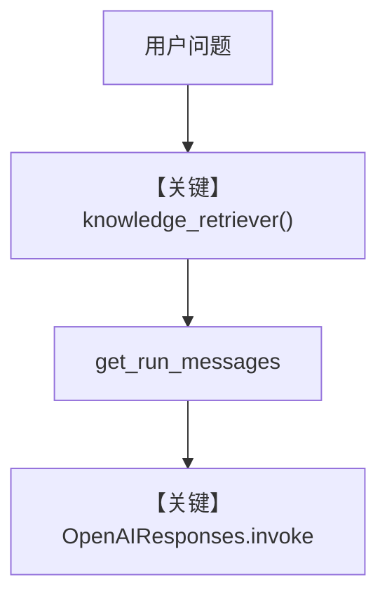

# 01_custom_retriever.py — 实现原理分析

> 源文件：`cookbook/07_knowledge/04_advanced/01_custom_retriever.py`

## 概述

本示例展示 **`knowledge_retriever` 自定义检索**：不使用 `Knowledge` 默认向量管道，由 `company_retriever(agent, query, ...)` 返回 `list[dict]`，供 Agent 在 `search_knowledge` 路径消费。

**核心配置一览：**

| 配置项 | 值 | 说明 |
|--------|------|------|
| `model` | `OpenAIResponses(id="gpt-5.2")` | Responses |
| `knowledge_retriever` | `company_retriever` | 自定义函数 |
| `markdown` | `True` | Markdown |
| `knowledge` | 无 | 未设置（非 Knowledge 类 RAG） |
| `search_knowledge` | 未显式传入 | Agent 默认 `True`（`agent.py`），会注册检索相关工具/指令 |

> 注意：本文件未构造 `Knowledge`，仅用 `knowledge_retriever` 覆盖检索实现。

## 架构分层

```
company_retriever(query) → 文档 dict 列表
        │
        ▼
Agent._run → 将检索结果注入消息 → OpenAIResponses
```

## 核心组件解析

### knowledge_retriever 签名

函数接收 `agent`, `query`, `num_documents` 等，返回可选的字典列表，模拟 HR/销售等分区数据的关键词匹配。

### 运行机制与因果链

1. **路径**：用户问题 → 框架调用自定义 retriever → 结果进入上下文 → 模型总结。
2. **副作用**：无持久化；纯内存 dict。
3. **分支**：`num_documents` 截断列表。
4. **差异**：相对标准 `Knowledge` + `Qdrant`，本示例 **完全绕过向量库**。

## System Prompt 组装

无 `instructions`/`description`；`markdown=True`。

### 还原后的完整 System 文本

```text
<additional_information>
- Use markdown to format your answers.
</additional_information>
```

## 完整 API 请求

`OpenAIResponses.responses.create`，输入含 developer 与 user；检索结果在消息组装阶段加入。

## Mermaid 流程图



## 关键源码文件索引

| 文件 | 作用 |
|------|------|
| `agno/agent/agent.py` | `knowledge_retriever` 属性 |
| `agno/agent/_messages.py` | 检索结果并入消息 |
| `agno/models/openai/responses.py` | Responses API |
