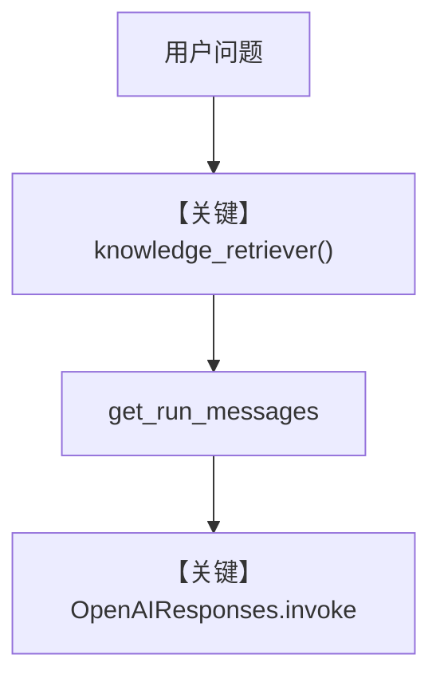

# 01_custom_retriever.py — 实现原理分析

<!-- cookbook-py-source:start -->
## 完整源码

```python
"""
Custom Retriever: Bypass the Knowledge Class
==============================================
Sometimes you need full control over retrieval logic. Instead of using
the Knowledge class, you can provide a custom retriever function.

The function receives the query and returns a list of dicts.
This is useful for:
- Non-vector retrieval (SQL queries, API calls, file lookups)
- Custom ranking logic
- Combining multiple data sources with custom logic

See also: ../01_getting_started/02_agentic_rag.py for standard Knowledge-based RAG.
"""

from typing import Dict, List, Optional, Union

from agno.agent import Agent
from agno.models.openai import OpenAIResponses

# ---------------------------------------------------------------------------
# Custom Retriever
# ---------------------------------------------------------------------------


def company_retriever(
    agent: Agent, query: str, num_documents: Optional[int] = None, **kwargs
) -> Optional[List[Union[Dict, str]]]:
    """Custom retriever that returns relevant documents based on the query.

    In production, this could query a SQL database, call an API, or
    implement any custom retrieval logic.

    Must return list of dicts (or strings), not Document objects.
    """
    # Simulated knowledge base
    documents = {
        "engineering": {
            "name": "Engineering",
            "content": "The engineering team uses Python and TypeScript. "
            "They follow trunk-based development with CI/CD.",
        },
        "sales": {
            "name": "Sales",
            "content": "Q4 revenue was $2.3M, up 40% year-over-year. "
            "The sales team closed 145 deals in Q4.",
        },
        "hr": {
            "name": "HR Policy",
            "content": "PTO policy: 25 days per year. Remote work is allowed "
            "3 days per week. All employees get learning stipends.",
        },
    }

    # Simple keyword matching (replace with your logic)
    results = []
    for _key, doc in documents.items():
        if any(term in query.lower() for term in doc["name"].lower().split()):
            results.append(doc)

    matched = results or list(documents.values())
    if num_documents is not None:
        matched = matched[:num_documents]
    return matched


# ---------------------------------------------------------------------------
# Create Agent
# ---------------------------------------------------------------------------

agent = Agent(
    model=OpenAIResponses(id="gpt-5.2"),
    knowledge_retriever=company_retriever,
    markdown=True,
)

# ---------------------------------------------------------------------------
# Run Demo
# ---------------------------------------------------------------------------

if __name__ == "__main__":
    print("\n" + "=" * 60)
    print("Custom retriever: query-specific document selection")
    print("=" * 60 + "\n")

    agent.print_response("What is the PTO policy?", stream=True)

    print("\n" + "=" * 60)
    print("Different query returns different documents")
    print("=" * 60 + "\n")

    agent.print_response("How did Q4 sales go?", stream=True)
```

<!-- cookbook-py-source:end -->

> 源文件：`cookbook/07_knowledge/04_advanced/01_custom_retriever.py`

## 概述

本示例展示 **`knowledge_retriever` 自定义检索**：不使用 `Knowledge` 默认向量管道，由 `company_retriever(agent, query, ...)` 返回 `list[dict]`，供 Agent 在 `search_knowledge` 路径消费。

**核心配置一览：**

| 配置项 | 值 | 说明 |
|--------|------|------|
| `model` | `OpenAIResponses(id="gpt-5.2")` | Responses |
| `knowledge_retriever` | `company_retriever` | 自定义函数 |
| `markdown` | `True` | Markdown |
| `knowledge` | 无 | 未设置（非 Knowledge 类 RAG） |
| `search_knowledge` | 未显式传入 | Agent 默认 `True`（`agent.py`），会注册检索相关工具/指令 |

> 注意：本文件未构造 `Knowledge`，仅用 `knowledge_retriever` 覆盖检索实现。

## 架构分层

```
company_retriever(query) → 文档 dict 列表
        │
        ▼
Agent._run → 将检索结果注入消息 → OpenAIResponses
```

## 核心组件解析

### knowledge_retriever 签名

函数接收 `agent`, `query`, `num_documents` 等，返回可选的字典列表，模拟 HR/销售等分区数据的关键词匹配。

### 运行机制与因果链

1. **路径**：用户问题 → 框架调用自定义 retriever → 结果进入上下文 → 模型总结。
2. **副作用**：无持久化；纯内存 dict。
3. **分支**：`num_documents` 截断列表。
4. **差异**：相对标准 `Knowledge` + `Qdrant`，本示例 **完全绕过向量库**。

## System Prompt 组装

无 `instructions`/`description`；`markdown=True`。

### 还原后的完整 System 文本

```text
<additional_information>
- Use markdown to format your answers.
</additional_information>
```

## 完整 API 请求

`OpenAIResponses.responses.create`，输入含 developer 与 user；检索结果在消息组装阶段加入。

## Mermaid 流程图



## 关键源码文件索引

| 文件 | 作用 |
|------|------|
| `agno/agent/agent.py` | `knowledge_retriever` 属性 |
| `agno/agent/_messages.py` | 检索结果并入消息 |
| `agno/models/openai/responses.py` | Responses API |
