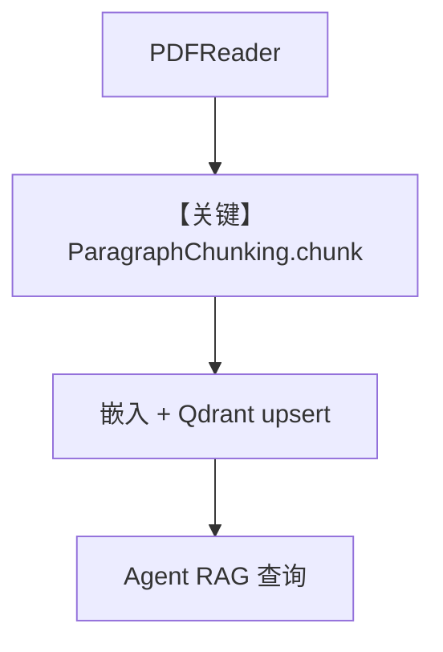

# 02_custom_chunking.py — 实现原理分析

<!-- cookbook-py-source:start -->
## 完整源码

```python
"""
Custom Chunking: Implementing Your Own Strategy
=================================================
When built-in strategies don't fit your content, implement a custom one.

A chunking strategy is a class that takes a Document and returns a list
of Document chunks. You control how content is split.

Use cases:
- Domain-specific splitting (legal clauses, medical records)
- Structured data (tables, forms)
- Content with custom delimiters

See also: ../02_building_blocks/01_chunking_strategies.py for built-in strategies.
"""

import asyncio

from agno.agent import Agent
from agno.knowledge.chunking.strategy import ChunkingStrategy
from agno.knowledge.document import Document
from agno.knowledge.embedder.openai import OpenAIEmbedder
from agno.knowledge.knowledge import Knowledge
from agno.knowledge.reader.pdf_reader import PDFReader
from agno.models.openai import OpenAIResponses
from agno.vectordb.qdrant import Qdrant
from agno.vectordb.search import SearchType

# ---------------------------------------------------------------------------
# Custom Chunking Strategy
# ---------------------------------------------------------------------------


class ParagraphChunking(ChunkingStrategy):
    """Splits documents on double newlines (paragraphs).

    Each paragraph becomes its own chunk. Simple but effective
    for well-structured prose content.
    """

    def chunk(self, document: Document) -> list[Document]:
        chunks = []
        if not document.content:
            return chunks

        paragraphs = document.content.split("\n\n")
        for i, paragraph in enumerate(paragraphs):
            paragraph = paragraph.strip()
            if paragraph:
                chunks.append(
                    Document(
                        name="%s_chunk_%d" % (document.name, i),
                        content=paragraph,
                        meta_data={
                            **(document.meta_data or {}),
                            "chunk_index": i,
                            "chunking_strategy": "paragraph",
                        },
                    )
                )
        return chunks


# ---------------------------------------------------------------------------
# Setup
# ---------------------------------------------------------------------------

qdrant_url = "http://localhost:6333"

knowledge = Knowledge(
    vector_db=Qdrant(
        collection="custom_chunking",
        url=qdrant_url,
        search_type=SearchType.hybrid,
        embedder=OpenAIEmbedder(id="text-embedding-3-small"),
    ),
)

# Use the custom chunking strategy with a PDF reader
reader = PDFReader(chunking_strategy=ParagraphChunking())

agent = Agent(
    model=OpenAIResponses(id="gpt-5.2"),
    knowledge=knowledge,
    search_knowledge=True,
    markdown=True,
)

# ---------------------------------------------------------------------------
# Run Demo
# ---------------------------------------------------------------------------

if __name__ == "__main__":

    async def main():
        await knowledge.ainsert(
            url="https://agno-public.s3.amazonaws.com/recipes/ThaiRecipes.pdf",
            reader=reader,
        )

        print("\n" + "=" * 60)
        print("Custom paragraph-based chunking")
        print("=" * 60 + "\n")

        agent.print_response("What Thai recipes do you know about?", stream=True)

    asyncio.run(main())
```

<!-- cookbook-py-source:end -->

> 源文件：`cookbook/07_knowledge/04_advanced/02_custom_chunking.py`

## 概述

本示例展示 **自定义 `ChunkingStrategy`**：实现 `ParagraphChunking`，在 `PDFReader(chunking_strategy=...)` 与 `knowledge.ainsert` 链路中把文档按段落切分为多个 `Document` 再嵌入索引。

**核心配置一览：**

| 配置项 | 值 | 说明 |
|--------|------|------|
| `Knowledge.vector_db` | `Qdrant(..., hybrid, OpenAIEmbedder)` | 向量库 |
| `reader` | `PDFReader(chunking_strategy=ParagraphChunking())` | 自定义分块 |
| `Agent.model` | `OpenAIResponses(id="gpt-5.2")` | Responses |
| `search_knowledge` | `True` | RAG |
| `markdown` | `True` | Markdown |

## 架构分层

```
PDF → PDFReader.chunk → ParagraphChunking.chunk → 多 Document → 嵌入 → Qdrant
                                                      │
                                                      ▼
                                              Agent.print_response
```

## 核心组件解析

### ParagraphChunking

继承 `ChunkingStrategy`，`chunk()` 按 `\n\n` 分段并写入 `meta_data`（`chunk_index` 等）。

### 运行机制与因果链

1. **路径**：远程 PDF → reader 解析 → 自定义切块 → 写入向量库 → 查询时按块检索。
2. **副作用**：Qdrant 持久化；无 session。
3. **分支**：空内容返回空 chunk 列表。
4. **差异**：与 `../02_building_blocks` 内置策略相比，本文件展示 **最小自定义 Strategy 模板**。

## System Prompt 组装

`markdown=True`，无 `instructions`。

### 还原后的完整 System 文本

```text
<additional_information>
- Use markdown to format your answers.
</additional_information>
```

（若启用 `add_search_knowledge_instructions` 默认 True，还会有知识库使用说明，见 `_messages.py` 知识相关段。）

## 完整 API 请求

`OpenAIResponses` → `responses.create`。

## Mermaid 流程图



## 关键源码文件索引

| 文件 | 作用 |
|------|------|
| `agno/knowledge/chunking/strategy.py` | `ChunkingStrategy` 基类 |
| `agno/knowledge/reader/pdf_reader.py` | Reader 调 chunk |
| `agno/agent/_messages.py` | System / 检索消息 |
