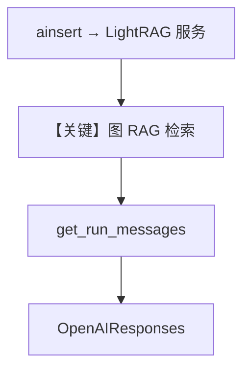

# 03_graph_rag.py — 实现原理分析

> 源文件：`cookbook/07_knowledge/04_advanced/03_graph_rag.py`

## 概述

本示例展示 **LightRAG 向量后端**（`LightRag`）：在 `pip install lightrag-agno` 可用时，用托管图 RAG 服务替代纯向量流水线；`ImportError` 时降级为打印安装提示。

**核心配置一览：**

| 配置项 | 值 | 说明 |
|--------|------|------|
| `vector_db` | `LightRag(server_url="http://localhost:9621")` | LightRAG 服务 |
| `Agent.model` | `OpenAIResponses(id="gpt-5.2")` | 条件构造 |
| `search_knowledge` | `True` | RAG |
| `markdown` | `True` | Markdown |

## 架构分层

```
Knowledge(LightRag) → 远端图索引/检索
        │
        ▼
Agent → OpenAIResponses
```

## 核心组件解析

### try/ImportError

无依赖时 `knowledge`/`agent` 为 `None`，`main` 内跳过，避免导入期崩溃。

### 运行机制与因果链

1. **路径**：`ainsert` PDF → LightRAG 侧建图/索引 → 用户多跳风格问题 → 模型回答。
2. **副作用**：依赖外部 `9621` 服务状态。
3. **分支**：未安装包则不走 LLM。
4. **差异**：相对 `Qdrant` 示例，检索语义为 **图增强** 而非纯向量相似度。

## System Prompt 组装

与标准 Agent 一致（`markdown`）。

### 还原后的完整 System 文本

```text
<additional_information>
- Use markdown to format your answers.
</additional_information>
```

## 完整 API 请求

`OpenAIResponses.responses.create`；LightRAG 细节在 `agno/vectordb/lightrag` 适配器内。

## Mermaid 流程图



## 关键源码文件索引

| 文件 | 作用 |
|------|------|
| `agno/vectordb/lightrag` | LightRag 封装 |
| `agno/models/openai/responses.py` | Responses API |
