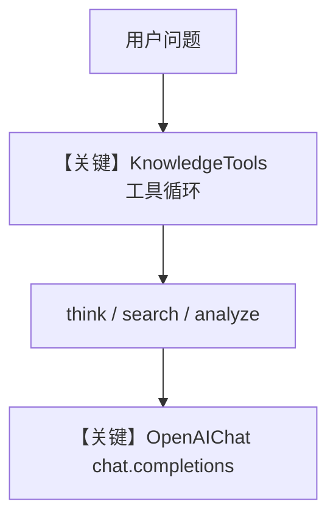

# 04_knowledge_tools.py — 实现原理分析

<!-- cookbook-py-source:start -->
## 完整源码

```python
"""
Knowledge Tools: Think, Search, Analyze
=========================================
KnowledgeTools provides a richer set of tools for knowledge interaction
beyond basic search:

- think: Agent reasons about the query before searching
- search: Standard knowledge base search
- analyze: Deep analysis of search results

This gives agents more sophisticated reasoning over knowledge.
"""

import asyncio

from agno.agent import Agent
from agno.knowledge.embedder.openai import OpenAIEmbedder
from agno.knowledge.knowledge import Knowledge
from agno.models.openai import OpenAIChat
from agno.tools.knowledge import KnowledgeTools
from agno.vectordb.qdrant import Qdrant
from agno.vectordb.search import SearchType

# ---------------------------------------------------------------------------
# Setup
# ---------------------------------------------------------------------------

qdrant_url = "http://localhost:6333"

knowledge = Knowledge(
    vector_db=Qdrant(
        collection="knowledge_tools_demo",
        url=qdrant_url,
        search_type=SearchType.hybrid,
        embedder=OpenAIEmbedder(id="text-embedding-3-small"),
    ),
)

knowledge_tools = KnowledgeTools(
    knowledge=knowledge,
    enable_think=True,
    enable_search=True,
    enable_analyze=True,
    add_few_shot=True,
)

# ---------------------------------------------------------------------------
# Create Agent
# ---------------------------------------------------------------------------

agent = Agent(
    model=OpenAIChat(id="gpt-4o"),
    tools=[knowledge_tools],
    markdown=True,
)

# ---------------------------------------------------------------------------
# Run Demo
# ---------------------------------------------------------------------------

if __name__ == "__main__":

    async def main():
        await knowledge.ainsert(url="https://docs.agno.com/llms-full.txt")

        print("\n" + "=" * 60)
        print("KnowledgeTools: think + search + analyze")
        print("=" * 60 + "\n")

        agent.print_response(
            "How do I build a team of agents in Agno?",
            stream=True,
        )

    asyncio.run(main())
```

<!-- cookbook-py-source:end -->

> 源文件：`cookbook/07_knowledge/04_advanced/04_knowledge_tools.py`

## 概述

本示例展示 **`KnowledgeTools`（think / search / analyze）**：不依赖 `search_knowledge` 自动注入单工具，而是把 **显式工具集** `KnowledgeTools` 交给 `Agent(tools=[...])`，让模型多步推理后再检索、再分析。

**核心配置一览：**

| 配置项 | 值 | 说明 |
|--------|------|------|
| `Knowledge.vector_db` | `Qdrant(..., hybrid)` | 知识存储 |
| `KnowledgeTools` | `enable_think/search/analyze=True`, `add_few_shot=True` | 工具组 |
| `Agent.model` | `OpenAIChat(id="gpt-4o")` | **Chat Completions**（非 Responses） |
| `Agent.tools` | `[knowledge_tools]` | 显式工具 |
| `markdown` | `True` | Markdown |
| `search_knowledge` | 未设置 | 默认 True，但本示例以 **工具调用** 为主路径 |

## 架构分层

```
Agent → OpenAIChat → chat.completions.create + tools
        │
        └→ KnowledgeTools → 内部访问 Knowledge
```

## 核心组件解析

### KnowledgeTools

提供 `think`（先推理）、`search`、`analyze` 等，形成 agentic 工具循环。

### 运行机制与因果链

1. **路径**：ingest 文档 → 用户问 → 模型可能多次 tool call → 最终自然语言回答。
2. **副作用**：向量库写入；对话级工具状态由模型回合驱动。
3. **分支**：模型可跳过 think 直接 search，取决于提示与 few-shot。
4. **差异**：相对 `search_knowledge=True` 的隐式 RAG，本示例 **工具边界更清晰、可观测**。

## System Prompt 组装

无自定义 `instructions`；工具模式由 `Function` 定义与 `KnowledgeTools` 内部说明补充。

### 还原后的完整 System 文本（基线）

```text
<additional_information>
- Use markdown to format your answers.
</additional_information>
```

实际运行会附加 **工具定义** 与 few-shot（由框架注入），无法仅凭 `.py` 静态还原全文；请在 `get_system_message` 返回前打印 `message.content` 或查看 OpenAI 请求 `tools` 字段核对。

## 完整 API 请求

```python
# OpenAIChat → chat.completions.create（非 responses.create）
client.chat.completions.create(
    model="gpt-4o",
    messages=[
        {"role": "system", "content": "<拼装后的 system + 工具说明>"},
        {"role": "user", "content": "How do I build a team of agents in Agno?"},
    ],
    tools=[...],  # KnowledgeTools 序列化结果
    stream=True,
)
```

`OpenAIChat` 的 `role_map` 通常保持 `system`（与 `OpenAIResponses` 的 developer 映射不同）。

## Mermaid 流程图



## 关键源码文件索引

| 文件 | 作用 |
|------|------|
| `agno/tools/knowledge.py` | `KnowledgeTools` |
| `agno/models/openai/chat.py` | `OpenAIChat.invoke`（若路径为 chat） |
| `agno/agent/_tools.py` | `get_tools()` |
