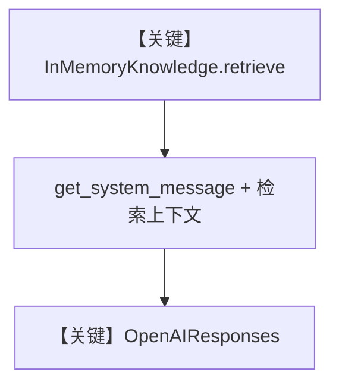

# 05_knowledge_protocol.py — 实现原理分析

<!-- cookbook-py-source:start -->
## 完整源码

```python
"""
Knowledge Protocol: Custom Knowledge Sources
==============================================
KnowledgeProtocol is an interface for building custom knowledge sources
that don't use the standard Knowledge class.

Implement this when you need:
- Knowledge from a non-standard source (file system, API, database)
- Custom search logic that doesn't fit the vector DB model
- Integration with existing retrieval systems

The protocol requires implementing build_context(), get_tools(), and aget_tools().
Optionally implement retrieve()/aretrieve() for the search_knowledge feature.
"""

from typing import Callable, List

from agno.agent import Agent
from agno.knowledge.document import Document
from agno.knowledge.protocol import KnowledgeProtocol
from agno.models.openai import OpenAIResponses

# ---------------------------------------------------------------------------
# Custom Knowledge Implementation
# ---------------------------------------------------------------------------


class InMemoryKnowledge(KnowledgeProtocol):
    """A simple in-memory knowledge source for demonstration.

    In production, this could wrap a SQL database, REST API,
    or any custom data source.
    """

    def __init__(self):
        self.documents: list[Document] = []

    def add(self, name: str, content: str) -> None:
        self.documents.append(Document(name=name, content=content))

    def _search(self, query: str, limit: int = 5) -> List[Document]:
        """Simple substring matching (replace with your search logic)."""
        results = []
        for doc in self.documents:
            if doc.content and query.lower() in doc.content.lower():
                results.append(doc)
        return results[:limit] or self.documents[:limit]

    # --- Required protocol methods ---

    def build_context(self, **kwargs) -> str:
        return "Use the search tool to find information in the knowledge base."

    def get_tools(self, **kwargs) -> List[Callable]:
        return []

    async def aget_tools(self, **kwargs) -> List[Callable]:
        return []

    # --- Optional: enables search_knowledge feature ---

    def retrieve(self, query: str, **kwargs) -> List[Document]:
        max_results = kwargs.get("max_results", 5)
        return self._search(query, limit=max_results)

    async def aretrieve(self, query: str, **kwargs) -> List[Document]:
        return self.retrieve(query, **kwargs)


# ---------------------------------------------------------------------------
# Setup
# ---------------------------------------------------------------------------

custom_knowledge = InMemoryKnowledge()
custom_knowledge.add("Python", "Python is a high-level programming language.")
custom_knowledge.add("TypeScript", "TypeScript adds static types to JavaScript.")
custom_knowledge.add(
    "Rust", "Rust is a systems language focused on safety and performance."
)

agent = Agent(
    model=OpenAIResponses(id="gpt-5.2"),
    knowledge=custom_knowledge,
    search_knowledge=True,
    markdown=True,
)

# ---------------------------------------------------------------------------
# Run Demo
# ---------------------------------------------------------------------------

if __name__ == "__main__":
    print("\n" + "=" * 60)
    print("Custom KnowledgeProtocol implementation")
    print("=" * 60 + "\n")

    agent.print_response("Tell me about Python", stream=True)
```

<!-- cookbook-py-source:end -->

> 源文件：`cookbook/07_knowledge/04_advanced/05_knowledge_protocol.py`

## 概述

本示例展示 **`KnowledgeProtocol` 自定义知识源**：实现 `InMemoryKnowledge`，提供 `build_context`、`get_tools`/`aget_tools`，并可选实现 `retrieve`/`aretrieve` 以支持 `search_knowledge` 的默认检索路径。

**核心配置一览：**

| 配置项 | 值 | 说明 |
|--------|------|------|
| `Agent.model` | `OpenAIResponses(id="gpt-5.2")` | Responses |
| `Agent.knowledge` | `InMemoryKnowledge()` 实例 | 协议实现 |
| `search_knowledge` | `True` | 走 `retrieve` |
| `markdown` | `True` | Markdown |
| `get_tools` | 返回 `[]` | 无额外工具 |

## 架构分层

```
InMemoryKnowledge.retrieve(query)
        │
        ▼
Agent 消息组装 → OpenAIResponses
```

## 核心组件解析

### KnowledgeProtocol

- `build_context`：返回简短提示，引导使用搜索（本例为固定英文句）。
- `retrieve`：简单子串匹配，命中则返回否则回退全量前 N 条。

### 运行机制与因果链

1. **路径**：`add()` 填充内存文档 → 用户提问 → `retrieve` → 上下文 → 模型。
2. **副作用**：仅进程内 list，无 DB。
3. **分支**：查询为空时 `_search` 用 `or self.documents[:limit]` 回退。
4. **差异**：相对 `Knowledge` + 向量库，本示例 **零向量、协议扩展点**。

## System Prompt 组装

`markdown=True`；`build_context` 文本进入知识相关系统段（具体拼接见 `KnowledgeProtocol` 与 `_messages.py` 交互）。

### 还原后的完整 System 文本（可静态部分）

`build_context` 字面量：

```text
Use the search tool to find information in the knowledge base.
```

（完整 system 另含 markdown 附加段与知识库指令，需运行时核对。）

## 完整 API 请求

`OpenAIResponses` → `responses.create`，`system`→`developer`。

## Mermaid 流程图



## 关键源码文件索引

| 文件 | 作用 |
|------|------|
| `agno/knowledge/protocol.py` | 协议定义 |
| `agno/agent/_messages.py` | 与 knowledge 交互 |
| `agno/models/openai/responses.py` | Responses API |
