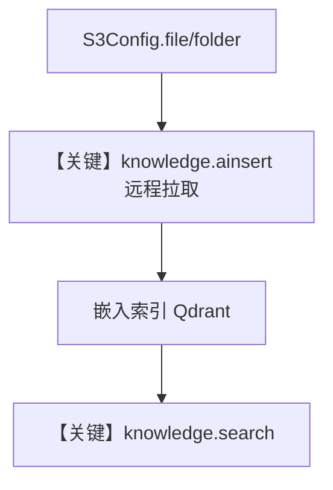

# 01_aws.py — 实现原理分析

> 源文件：`cookbook/07_knowledge/05_integrations/cloud/01_aws.py`

## 概述

本示例展示 **`S3Config` 远程内容源**：通过 `Knowledge(content_sources=[s3_config])` 与 `ainsert(remote_content=s3_config.file|folder(...))` 从 S3 拉取文件/前缀目录写入 Qdrant，最后用 **`knowledge.search()`** 验证检索，**无 Agent、无 LLM 调用**。

**核心配置一览：**

| 配置项 | 值 | 说明 |
|--------|------|------|
| `S3Config` | `id`, `name`, `bucket_name`, `region` 等 | 远程源配置 |
| `Knowledge` | `name`, `vector_db=Qdrant`, `content_sources` | 知识库 |
| `Agent` | 无 | 未使用 |

## 架构分层

```
S3 → remote_content 读取 → 解析/嵌入 → Qdrant
                                    │
                                    └→ knowledge.search(query)
```

## 核心组件解析

### S3Config.file / folder

生成可传给 `ainsert` 的远程内容句柄，支持单对象或前缀批量。

### 运行机制与因果链

1. **路径**：`ainsert` 拉取对象 → 索引 → `search` 返回 `Document` 列表。
2. **副作用**：本地/远端凭证依赖环境；向量持久化在 Qdrant。
3. **分支**：`folder` 与 `file` 摄入范围不同。
4. **差异**：相对 `05_integrations/readers`，本文件强调 **云对象存储为源**。

## System Prompt 组装

**本脚本未构造 `Agent`**，不存在 `get_system_message()` 的单一入口；若将同一 `Knowledge` 绑定 Agent，system 由该 Agent 参数决定。

## 完整 API 请求

- **无 OpenAI 请求**；向 Qdrant 的向量操作由 `Knowledge`/`Qdrant` 内部完成。
- 若扩展为 Agent，则按所选 `Model` 适配器发起调用。

## Mermaid 流程图



## 关键源码文件索引

| 文件 | 作用 |
|------|------|
| `agno/knowledge/remote_content` | `S3Config` |
| `agno/knowledge/knowledge.py` | `ainsert` / `search` |
| `agno/vectordb/qdrant` | 向量存储 |
