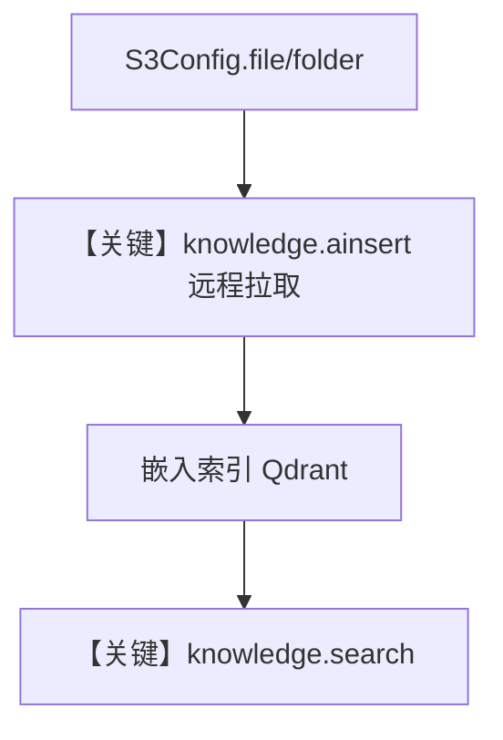

# 01_aws.py — 实现原理分析

<!-- cookbook-py-source:start -->
## 完整源码

```python
"""
AWS Integration: S3 Content Source
====================================
Load files and folders from S3 buckets into your Knowledge base.
Supports any S3-compatible storage with AWS credentials.

Features:
- Load single files or entire prefixes (folders) recursively
- Automatic file type detection and reader selection
- Metadata tagging per file (bucket, key, region)

Requirements:
- AWS credentials configured (env vars, profile, or IAM role)
- S3 bucket with read access

Environment Variables:
    AWS_ACCESS_KEY_ID     - AWS access key
    AWS_SECRET_ACCESS_KEY - AWS secret key
    AWS_REGION            - AWS region (default: us-east-1)
"""

import asyncio
from os import getenv

from agno.knowledge.knowledge import Knowledge
from agno.knowledge.remote_content import S3Config
from agno.vectordb.qdrant import Qdrant

# ---------------------------------------------------------------------------
# Setup
# ---------------------------------------------------------------------------

# Configure S3 content source
s3_config = S3Config(
    id="my-bucket",
    name="My S3 Bucket",
    bucket_name=getenv("AWS_S3_BUCKET", "my-bucket"),
    region=getenv("AWS_REGION", "us-east-1"),
)

knowledge = Knowledge(
    name="S3 Knowledge",
    vector_db=Qdrant(
        collection="s3_knowledge",
        url="http://localhost:6333",
    ),
    content_sources=[s3_config],
)

# ---------------------------------------------------------------------------
# Run Demo
# ---------------------------------------------------------------------------

if __name__ == "__main__":

    async def main():
        # Insert a single file from S3
        print("\n" + "=" * 60)
        print("Loading single file from S3")
        print("=" * 60 + "\n")

        await knowledge.ainsert(
            name="Report",
            remote_content=s3_config.file("reports/quarterly-report.pdf"),
        )

        # Insert an entire folder (prefix)
        print("\n" + "=" * 60)
        print("Loading folder from S3")
        print("=" * 60 + "\n")

        await knowledge.ainsert(
            name="All Reports",
            remote_content=s3_config.folder("reports/"),
        )

        # Search
        results = knowledge.search("What were the quarterly results?")
        for doc in results:
            print("- %s" % doc.name)

    asyncio.run(main())
```

<!-- cookbook-py-source:end -->

> 源文件：`cookbook/07_knowledge/05_integrations/cloud/01_aws.py`

## 概述

本示例展示 **`S3Config` 远程内容源**：通过 `Knowledge(content_sources=[s3_config])` 与 `ainsert(remote_content=s3_config.file|folder(...))` 从 S3 拉取文件/前缀目录写入 Qdrant，最后用 **`knowledge.search()`** 验证检索，**无 Agent、无 LLM 调用**。

**核心配置一览：**

| 配置项 | 值 | 说明 |
|--------|------|------|
| `S3Config` | `id`, `name`, `bucket_name`, `region` 等 | 远程源配置 |
| `Knowledge` | `name`, `vector_db=Qdrant`, `content_sources` | 知识库 |
| `Agent` | 无 | 未使用 |

## 架构分层

```
S3 → remote_content 读取 → 解析/嵌入 → Qdrant
                                    │
                                    └→ knowledge.search(query)
```

## 核心组件解析

### S3Config.file / folder

生成可传给 `ainsert` 的远程内容句柄，支持单对象或前缀批量。

### 运行机制与因果链

1. **路径**：`ainsert` 拉取对象 → 索引 → `search` 返回 `Document` 列表。
2. **副作用**：本地/远端凭证依赖环境；向量持久化在 Qdrant。
3. **分支**：`folder` 与 `file` 摄入范围不同。
4. **差异**：相对 `05_integrations/readers`，本文件强调 **云对象存储为源**。

## System Prompt 组装

**本脚本未构造 `Agent`**，不存在 `get_system_message()` 的单一入口；若将同一 `Knowledge` 绑定 Agent，system 由该 Agent 参数决定。

## 完整 API 请求

- **无 OpenAI 请求**；向 Qdrant 的向量操作由 `Knowledge`/`Qdrant` 内部完成。
- 若扩展为 Agent，则按所选 `Model` 适配器发起调用。

## Mermaid 流程图



## 关键源码文件索引

| 文件 | 作用 |
|------|------|
| `agno/knowledge/remote_content` | `S3Config` |
| `agno/knowledge/knowledge.py` | `ainsert` / `search` |
| `agno/vectordb/qdrant` | 向量存储 |
