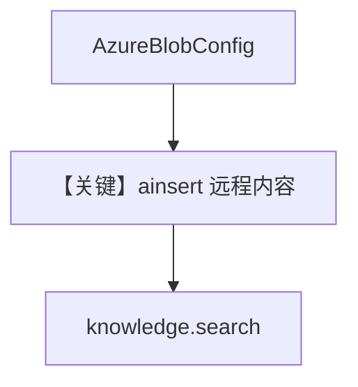

# 02_azure.py — 实现原理分析

> 源文件：`cookbook/07_knowledge/05_integrations/cloud/02_azure.py`

## 概述

本示例展示 **`AzureBlobConfig` 远程内容**：Azure AD 客户端凭据访问 Blob，`ainsert` 单文件或前缀目录，最后 **`knowledge.search`** 验证。**无 Agent**。

**核心配置一览：**

| 配置项 | 值 | 说明 |
|--------|------|------|
| `AzureBlobConfig` | tenant/client/secret/storage/container | 认证与容器 |
| `Knowledge` | `vector_db=Qdrant`, `content_sources=[azure_blob]` | 知识库 |
| `Agent` | 无 | 未使用 |

## 架构分层

```
Azure Blob → remote_content → 解析嵌入 → Qdrant → knowledge.search
```

## 核心组件解析

与 `01_aws.py` 对称，换为 `AzureBlobConfig` 与 `file`/`folder` 路径语义。

### 运行机制与因果链

1. **路径**：认证 → 列出/下载 blob → 索引 → 搜索。
2. **副作用**：需有效 Azure 凭据与环境变量。
3. **差异**：与 S3 示例相比仅 **厂商与配置类** 不同。

## System Prompt 组装

无 Agent，不适用 `get_system_message`。

## 完整 API 请求

无 LLM；仅存储与检索 API（Qdrant HTTP、gRPC 等由客户端处理）。

## Mermaid 流程图



## 关键源码文件索引

| 文件 | 作用 |
|------|------|
| `agno/knowledge/remote_content` | `AzureBlobConfig` |
| `agno/knowledge/knowledge.py` | 摄入与搜索 |
