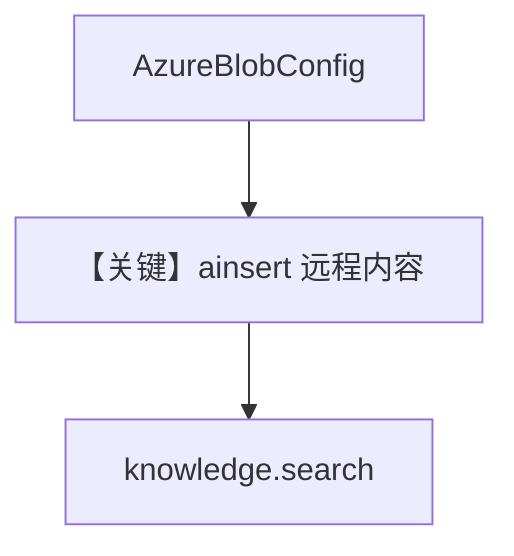

# 02_azure.py — 实现原理分析

<!-- cookbook-py-source:start -->
## 完整源码

```python
"""
Azure Integration: Blob Storage
=================================
Load files and folders from Azure Blob Storage containers into your Knowledge base.

Features:
- Load single files or entire prefixes (folders)
- Uses Azure AD client credentials for authentication

Requirements:
- Azure AD App Registration with Storage Blob Data Reader role
- Client ID, Client Secret, and Tenant ID

Environment Variables:
    AZURE_TENANT_ID            - Azure AD tenant ID
    AZURE_CLIENT_ID            - App registration client ID
    AZURE_CLIENT_SECRET        - App registration client secret
    AZURE_STORAGE_ACCOUNT_NAME - Storage account name
    AZURE_CONTAINER_NAME       - Container name
"""

import asyncio
from os import getenv

from agno.knowledge.knowledge import Knowledge
from agno.knowledge.remote_content import AzureBlobConfig
from agno.vectordb.qdrant import Qdrant

# ---------------------------------------------------------------------------
# Setup
# ---------------------------------------------------------------------------

azure_blob = AzureBlobConfig(
    id="company-blob",
    name="Company Blob Storage",
    tenant_id=getenv("AZURE_TENANT_ID"),
    client_id=getenv("AZURE_CLIENT_ID"),
    client_secret=getenv("AZURE_CLIENT_SECRET"),
    storage_account=getenv("AZURE_STORAGE_ACCOUNT_NAME"),
    container=getenv("AZURE_CONTAINER_NAME"),
)

knowledge = Knowledge(
    name="Azure Blob Knowledge",
    vector_db=Qdrant(
        collection="azure_blob_knowledge",
        url="http://localhost:6333",
    ),
    content_sources=[azure_blob],
)

# ---------------------------------------------------------------------------
# Run Demo
# ---------------------------------------------------------------------------

if __name__ == "__main__":

    async def main():
        # Single file
        print("\n" + "=" * 60)
        print("Azure Blob Storage: single file")
        print("=" * 60 + "\n")

        await knowledge.ainsert(
            name="Report",
            remote_content=azure_blob.file("reports/annual-report.pdf"),
        )

        # Folder
        print("\n" + "=" * 60)
        print("Azure Blob Storage: folder")
        print("=" * 60 + "\n")

        await knowledge.ainsert(
            name="All Docs",
            remote_content=azure_blob.folder("documents/"),
        )

        results = knowledge.search("What were the annual results?")
        for doc in results:
            print("- %s" % doc.name)

    asyncio.run(main())
```

<!-- cookbook-py-source:end -->

> 源文件：`cookbook/07_knowledge/05_integrations/cloud/02_azure.py`

## 概述

本示例展示 **`AzureBlobConfig` 远程内容**：Azure AD 客户端凭据访问 Blob，`ainsert` 单文件或前缀目录，最后 **`knowledge.search`** 验证。**无 Agent**。

**核心配置一览：**

| 配置项 | 值 | 说明 |
|--------|------|------|
| `AzureBlobConfig` | tenant/client/secret/storage/container | 认证与容器 |
| `Knowledge` | `vector_db=Qdrant`, `content_sources=[azure_blob]` | 知识库 |
| `Agent` | 无 | 未使用 |

## 架构分层

```
Azure Blob → remote_content → 解析嵌入 → Qdrant → knowledge.search
```

## 核心组件解析

与 `01_aws.py` 对称，换为 `AzureBlobConfig` 与 `file`/`folder` 路径语义。

### 运行机制与因果链

1. **路径**：认证 → 列出/下载 blob → 索引 → 搜索。
2. **副作用**：需有效 Azure 凭据与环境变量。
3. **差异**：与 S3 示例相比仅 **厂商与配置类** 不同。

## System Prompt 组装

无 Agent，不适用 `get_system_message`。

## 完整 API 请求

无 LLM；仅存储与检索 API（Qdrant HTTP、gRPC 等由客户端处理）。

## Mermaid 流程图



## 关键源码文件索引

| 文件 | 作用 |
|------|------|
| `agno/knowledge/remote_content` | `AzureBlobConfig` |
| `agno/knowledge/knowledge.py` | 摄入与搜索 |
