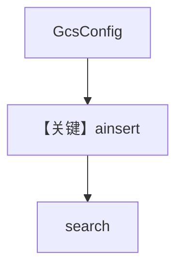

# 03_gcp.py — 实现原理分析

> 源文件：`cookbook/07_knowledge/05_integrations/cloud/03_gcp.py`

## 概述

本示例展示 **`GcsConfig`（Google Cloud Storage）** 作为 `content_sources`，`ainsert` 后 `knowledge.search`。**无 Agent**。

**核心配置一览：**

| 配置项 | 值 | 说明 |
|--------|------|------|
| `GcsConfig` | `bucket_name` 等 | GCS 配置 |
| `Knowledge` | `Qdrant` + `content_sources` | 知识库 |

## 架构分层

```
GCS → ainsert → Qdrant → search
```

## 核心组件解析

### GcsConfig.file / folder

与 AWS/Azure 相同模式，统一远程内容抽象。

### 运行机制与因果链

1. 依赖 `GOOGLE_APPLICATION_CREDENTIALS` 等 GCP 凭据。
2. 与 `01_aws` / `02_azure` 为 **同一集成模式不同云**。

## System Prompt 组装

无 Agent。

## 完整 API 请求

无 OpenAI；GCS 与 Qdrant 为基础设施调用。

## Mermaid 流程图



## 关键源码文件索引

| 文件 | 作用 |
|------|------|
| `agno/knowledge/remote_content` | `GcsConfig` |
| `agno/knowledge/knowledge.py` | `ainsert` / `search` |
