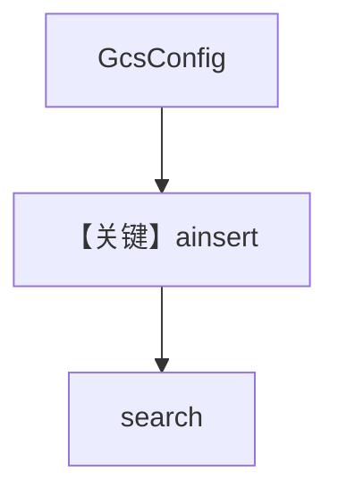

# 03_gcp.py — 实现原理分析

<!-- cookbook-py-source:start -->
## 完整源码

```python
"""
GCP Integration: Google Cloud Storage
=======================================
Load files and folders from GCS buckets into your Knowledge base.

Features:
- Load single files or entire prefixes recursively
- Automatic file type detection
- Service account or application default credentials

Requirements:
- GCP credentials configured
- GCS bucket with read access

Environment Variables:
    GOOGLE_APPLICATION_CREDENTIALS - Path to service account key file
    GCS_BUCKET_NAME               - GCS bucket name
"""

import asyncio
from os import getenv

from agno.knowledge.knowledge import Knowledge
from agno.knowledge.remote_content import GcsConfig
from agno.vectordb.qdrant import Qdrant

# ---------------------------------------------------------------------------
# Setup
# ---------------------------------------------------------------------------

gcs_config = GcsConfig(
    id="my-gcs-bucket",
    name="My GCS Bucket",
    bucket_name=getenv("GCS_BUCKET_NAME", "my-bucket"),
)

knowledge = Knowledge(
    name="GCS Knowledge",
    vector_db=Qdrant(
        collection="gcs_knowledge",
        url="http://localhost:6333",
    ),
    content_sources=[gcs_config],
)

# ---------------------------------------------------------------------------
# Run Demo
# ---------------------------------------------------------------------------

if __name__ == "__main__":

    async def main():
        # Single file
        print("\n" + "=" * 60)
        print("GCS: single file")
        print("=" * 60 + "\n")

        await knowledge.ainsert(
            name="Report",
            remote_content=gcs_config.file("reports/quarterly.pdf"),
        )

        # Folder
        print("\n" + "=" * 60)
        print("GCS: folder")
        print("=" * 60 + "\n")

        await knowledge.ainsert(
            name="All Reports",
            remote_content=gcs_config.folder("reports/"),
        )

        results = knowledge.search("What were the results?")
        for doc in results:
            print("- %s" % doc.name)

    asyncio.run(main())
```

<!-- cookbook-py-source:end -->

> 源文件：`cookbook/07_knowledge/05_integrations/cloud/03_gcp.py`

## 概述

本示例展示 **`GcsConfig`（Google Cloud Storage）** 作为 `content_sources`，`ainsert` 后 `knowledge.search`。**无 Agent**。

**核心配置一览：**

| 配置项 | 值 | 说明 |
|--------|------|------|
| `GcsConfig` | `bucket_name` 等 | GCS 配置 |
| `Knowledge` | `Qdrant` + `content_sources` | 知识库 |

## 架构分层

```
GCS → ainsert → Qdrant → search
```

## 核心组件解析

### GcsConfig.file / folder

与 AWS/Azure 相同模式，统一远程内容抽象。

### 运行机制与因果链

1. 依赖 `GOOGLE_APPLICATION_CREDENTIALS` 等 GCP 凭据。
2. 与 `01_aws` / `02_azure` 为 **同一集成模式不同云**。

## System Prompt 组装

无 Agent。

## 完整 API 请求

无 OpenAI；GCS 与 Qdrant 为基础设施调用。

## Mermaid 流程图



## 关键源码文件索引

| 文件 | 作用 |
|------|------|
| `agno/knowledge/remote_content` | `GcsConfig` |
| `agno/knowledge/knowledge.py` | `ainsert` / `search` |
