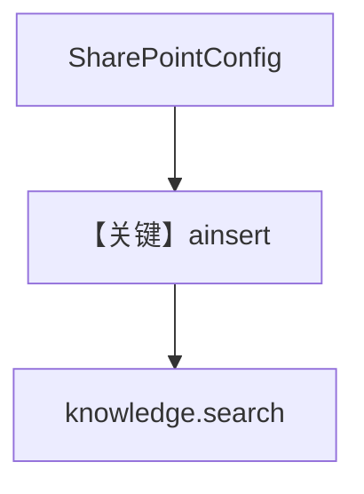

# 04_sharepoint.py — 实现原理分析

> 源文件：`cookbook/07_knowledge/05_integrations/cloud/04_sharepoint.py`

## 概述

本示例展示 **`SharePointConfig`**：通过 Microsoft Graph 访问 SharePoint 文档库，`file`/`folder` 摄入后 **`knowledge.search`**。**无 Agent**。

**核心配置一览：**

| 配置项 | 值 | 说明 |
|--------|------|------|
| `SharePointConfig` | tenant/client/secret/hostname | Graph 凭据 |
| `Knowledge` | `Qdrant` + `content_sources` | 知识库 |

## 架构分层

```
SharePoint → remote_content → 索引 → Qdrant → search
```

## 核心组件解析

与多云示例一致；路径为 SharePoint 站点内逻辑路径（如 `Shared Documents/...`）。

### 运行机制与因果链

需 `Sites.Read.All` 等权限；失败时体现在摄入异常而非 LLM。

## System Prompt 组装

无 Agent。

## 完整 API 请求

无 LLM。

## Mermaid 流程图



## 关键源码文件索引

| 文件 | 作用 |
|------|------|
| `agno/knowledge/remote_content` | `SharePointConfig` |
| `agno/knowledge/knowledge.py` | 摄入/搜索 |
