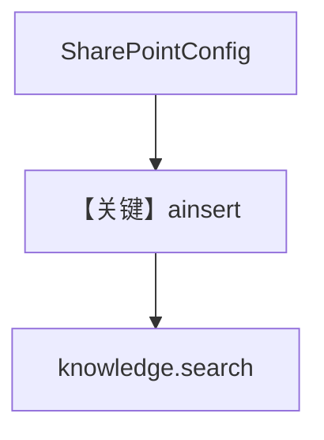

# 04_sharepoint.py — 实现原理分析

<!-- cookbook-py-source:start -->
## 完整源码

```python
"""
SharePoint Integration
=======================
Load files and folders from SharePoint document libraries into your Knowledge base.

Features:
- Load single files or entire folders from SharePoint
- Uses Azure AD client credentials with Sites.Read.All permission

Requirements:
- Azure AD App Registration with Sites.Read.All permission
- Client ID, Client Secret, and Tenant ID

Environment Variables:
    AZURE_TENANT_ID     - Azure AD tenant ID
    AZURE_CLIENT_ID     - App registration client ID
    AZURE_CLIENT_SECRET - App registration client secret
    SHAREPOINT_HOSTNAME - SharePoint hostname (e.g. contoso.sharepoint.com)
"""

import asyncio
from os import getenv

from agno.knowledge.knowledge import Knowledge
from agno.knowledge.remote_content import SharePointConfig
from agno.vectordb.qdrant import Qdrant

# ---------------------------------------------------------------------------
# Setup
# ---------------------------------------------------------------------------

sharepoint = SharePointConfig(
    id="company-sharepoint",
    name="Company SharePoint",
    tenant_id=getenv("AZURE_TENANT_ID"),
    client_id=getenv("AZURE_CLIENT_ID"),
    client_secret=getenv("AZURE_CLIENT_SECRET"),
    hostname=getenv("SHAREPOINT_HOSTNAME"),
)

knowledge = Knowledge(
    name="SharePoint Knowledge",
    vector_db=Qdrant(
        collection="sharepoint_knowledge",
        url="http://localhost:6333",
    ),
    content_sources=[sharepoint],
)

# ---------------------------------------------------------------------------
# Run Demo
# ---------------------------------------------------------------------------

if __name__ == "__main__":

    async def main():
        # Single file
        print("\n" + "=" * 60)
        print("SharePoint: single file")
        print("=" * 60 + "\n")

        await knowledge.ainsert(
            name="Policy Doc",
            remote_content=sharepoint.file("Shared Documents/policy.pdf"),
        )

        # Folder
        print("\n" + "=" * 60)
        print("SharePoint: folder")
        print("=" * 60 + "\n")

        await knowledge.ainsert(
            name="All Shared Docs",
            remote_content=sharepoint.folder("Shared Documents/"),
        )

        results = knowledge.search("What is the policy?")
        for doc in results:
            print("- %s" % doc.name)

    asyncio.run(main())
```

<!-- cookbook-py-source:end -->

> 源文件：`cookbook/07_knowledge/05_integrations/cloud/04_sharepoint.py`

## 概述

本示例展示 **`SharePointConfig`**：通过 Microsoft Graph 访问 SharePoint 文档库，`file`/`folder` 摄入后 **`knowledge.search`**。**无 Agent**。

**核心配置一览：**

| 配置项 | 值 | 说明 |
|--------|------|------|
| `SharePointConfig` | tenant/client/secret/hostname | Graph 凭据 |
| `Knowledge` | `Qdrant` + `content_sources` | 知识库 |

## 架构分层

```
SharePoint → remote_content → 索引 → Qdrant → search
```

## 核心组件解析

与多云示例一致；路径为 SharePoint 站点内逻辑路径（如 `Shared Documents/...`）。

### 运行机制与因果链

需 `Sites.Read.All` 等权限；失败时体现在摄入异常而非 LLM。

## System Prompt 组装

无 Agent。

## 完整 API 请求

无 LLM。

## Mermaid 流程图



## 关键源码文件索引

| 文件 | 作用 |
|------|------|
| `agno/knowledge/remote_content` | `SharePointConfig` |
| `agno/knowledge/knowledge.py` | 摄入/搜索 |
