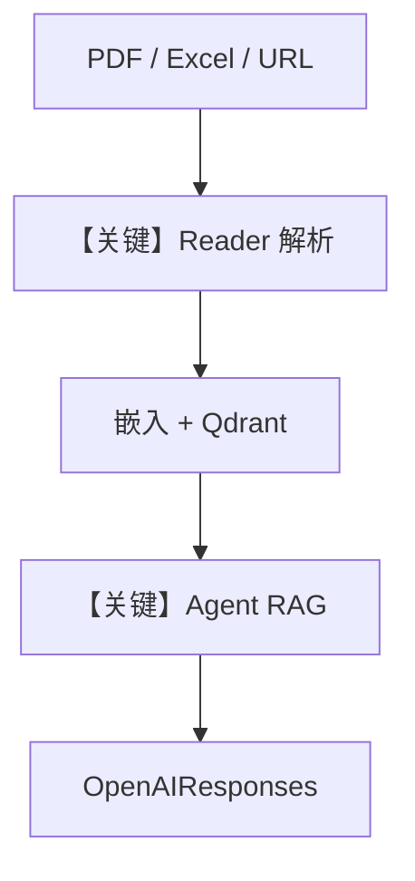

# 01_documents.py — 实现原理分析

<!-- cookbook-py-source:start -->
## 完整源码

```python
"""
Document Readers: PDF, DOCX, PPTX, Excel
==========================================
Knowledge auto-detects file types and selects the right reader.
You can also specify a reader explicitly for more control.

Supported document formats:
- PDF: Text extraction with optional OCR
- DOCX: Microsoft Word documents
- PPTX: PowerPoint presentations
- Excel: .xlsx and .xls spreadsheets

See also: 02_data.py for CSV/JSON, 03_web.py for web sources.
"""

import asyncio

from agno.agent import Agent
from agno.knowledge.embedder.openai import OpenAIEmbedder
from agno.knowledge.knowledge import Knowledge
from agno.knowledge.reader.excel_reader import ExcelReader

# Other available readers (used via auto-detection or explicit import):
# from agno.knowledge.reader.docx_reader import DocxReader
# from agno.knowledge.reader.pdf_reader import PDFReader
# from agno.knowledge.reader.pptx_reader import PPTXReader
from agno.models.openai import OpenAIResponses
from agno.vectordb.qdrant import Qdrant
from agno.vectordb.search import SearchType

# ---------------------------------------------------------------------------
# Setup
# ---------------------------------------------------------------------------

qdrant_url = "http://localhost:6333"

knowledge = Knowledge(
    vector_db=Qdrant(
        collection="document_readers",
        url=qdrant_url,
        search_type=SearchType.hybrid,
        embedder=OpenAIEmbedder(id="text-embedding-3-small"),
    ),
)

agent = Agent(
    model=OpenAIResponses(id="gpt-5.2"),
    knowledge=knowledge,
    search_knowledge=True,
    markdown=True,
)

# ---------------------------------------------------------------------------
# Run Demo
# ---------------------------------------------------------------------------

if __name__ == "__main__":

    async def main():
        # --- PDF: auto-detected by file extension ---
        print("\n" + "=" * 60)
        print("READER: PDF (auto-detected)")
        print("=" * 60 + "\n")

        await knowledge.ainsert(
            name="CV",
            path="cookbook/07_knowledge/testing_resources/cv_1.pdf",
        )
        agent.print_response("What skills does Jordan Mitchell have?", stream=True)

        # --- Excel: explicit reader for more control ---
        print("\n" + "=" * 60)
        print("READER: Excel (explicit reader)")
        print("=" * 60 + "\n")

        await knowledge.ainsert(
            name="Products",
            path="cookbook/07_knowledge/testing_resources/sample_products.xlsx",
            reader=ExcelReader(),
        )
        agent.print_response("What products are listed?", stream=True)

        # --- PDF from URL: auto-detected ---
        print("\n" + "=" * 60)
        print("READER: PDF from URL")
        print("=" * 60 + "\n")

        await knowledge.ainsert(
            name="Recipes",
            url="https://agno-public.s3.amazonaws.com/recipes/ThaiRecipes.pdf",
        )
        agent.print_response("What Thai recipes are available?", stream=True)

    asyncio.run(main())
```

<!-- cookbook-py-source:end -->

> 源文件：`cookbook/07_knowledge/05_integrations/readers/01_documents.py`

## 概述

本示例展示 **多格式文档 Reader**：PDF 自动检测、`ExcelReader` 显式指定、以及 URL PDF；`Agent(OpenAIResponses)` + `search_knowledge=True` 做 **RAG 问答**。

**核心配置一览：**

| 配置项 | 值 | 说明 |
|--------|------|------|
| `Knowledge` | `Qdrant(hybrid, OpenAIEmbedder)` | 向量库 |
| `Agent.model` | `OpenAIResponses(id="gpt-5.2")` | Responses |
| `search_knowledge` | `True` | RAG |
| `markdown` | `True` | Markdown |

## 架构分层

```
path/url → Reader 解析 → 切块嵌入 → Qdrant
                                │
                                ▼
                         Agent.print_response
```

## 核心组件解析

### 自动 vs 显式 Reader

扩展名触发默认 Reader；Excel 等需 `reader=ExcelReader()` 精确控制。

### 运行机制与因果链

1. 多次 `ainsert` 写入同一 collection 不同 name。
2. 用户问题经检索增强后进入 `OpenAIResponses`。

## System Prompt 组装

默认；`markdown=True`。

### 还原后的完整 System 文本

```text
<additional_information>
- Use markdown to format your answers.
</additional_information>
```

## 完整 API 请求

`client.responses.create`，`system` 映射为 `developer`。

## Mermaid 流程图



## 关键源码文件索引

| 文件 | 作用 |
|------|------|
| `agno/knowledge/reader/*` | 各格式 Reader |
| `agno/agent/_messages.py` | 消息与检索 |
| `agno/models/openai/responses.py` | Responses |
