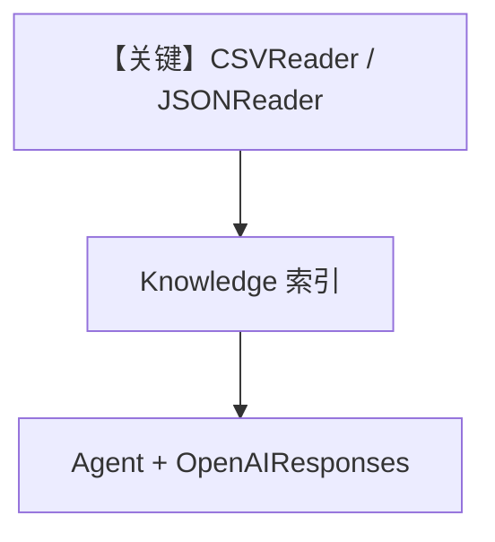

# 02_data.py — 实现原理分析

<!-- cookbook-py-source:start -->
## 完整源码

```python
"""
Data Readers: CSV, JSON, Field-Labeled CSV
============================================
Readers for structured data formats. CSV and JSON files are processed
row-by-row or as complete documents.

Supported data formats:
- CSV: Standard comma-separated values
- JSON: JSON files and arrays
- Field-Labeled CSV: CSV with column names as labels in output

See also: 01_documents.py for PDF/DOCX, 03_web.py for web sources.
"""

import asyncio

from agno.agent import Agent
from agno.knowledge.embedder.openai import OpenAIEmbedder
from agno.knowledge.knowledge import Knowledge
from agno.knowledge.reader.csv_reader import CSVReader
from agno.knowledge.reader.json_reader import JSONReader
from agno.models.openai import OpenAIResponses
from agno.vectordb.qdrant import Qdrant
from agno.vectordb.search import SearchType

# ---------------------------------------------------------------------------
# Setup
# ---------------------------------------------------------------------------

qdrant_url = "http://localhost:6333"

knowledge = Knowledge(
    vector_db=Qdrant(
        collection="data_readers",
        url=qdrant_url,
        search_type=SearchType.hybrid,
        embedder=OpenAIEmbedder(id="text-embedding-3-small"),
    ),
)

agent = Agent(
    model=OpenAIResponses(id="gpt-5.2"),
    knowledge=knowledge,
    search_knowledge=True,
    markdown=True,
)

# ---------------------------------------------------------------------------
# Run Demo
# ---------------------------------------------------------------------------

if __name__ == "__main__":

    async def main():
        # --- CSV: structured tabular data ---
        print("\n" + "=" * 60)
        print("READER: CSV")
        print("=" * 60 + "\n")

        # CSVReader reads each row as a separate document
        await knowledge.ainsert(
            name="Sample Data",
            text_content="name,role,department\nAlice,Engineer,Platform\nBob,Designer,Product\nCarol,Manager,Engineering",
            reader=CSVReader(),
        )
        agent.print_response("Who works in engineering?", stream=True)

        # --- JSON: structured data ---
        print("\n" + "=" * 60)
        print("READER: JSON")
        print("=" * 60 + "\n")

        await knowledge.ainsert(
            name="Config",
            text_content='{"app": "acme", "version": "2.0", "features": ["auth", "billing", "analytics"]}',
            reader=JSONReader(),
        )
        agent.print_response("What features does the app have?", stream=True)

    asyncio.run(main())
```

<!-- cookbook-py-source:end -->

> 源文件：`cookbook/07_knowledge/05_integrations/readers/02_data.py`

## 概述

本示例展示 **结构化数据 Reader**：`CSVReader` 处理表格文本、`JSONReader` 处理 JSON 字符串；`OpenAIResponses` + RAG 查询。

**核心配置一览：**

| 配置项 | 值 | 说明 |
|--------|------|------|
| `Knowledge` | `Qdrant(hybrid)` | 向量库 |
| `Agent` | `OpenAIResponses(gpt-5.2)`, `search_knowledge=True`, `markdown=True` | Agent |

## 架构分层

```
text_content + CSVReader/JSONReader → Document 流 → 嵌入 → Agent
```

## 核心组件解析

### CSVReader

按行/行组切分为可检索单元（具体策略见 Reader 实现）。

### 运行机制与因果链

内存字符串模拟文件；生产可换为 `path=` 指向真实 CSV/JSON。

## System Prompt 组装

默认 markdown 附加段。

### 还原后的完整 System 文本

```text
<additional_information>
- Use markdown to format your answers.
</additional_information>
```

## 完整 API 请求

`OpenAIResponses` → `responses.create`。

## Mermaid 流程图



## 关键源码文件索引

| 文件 | 作用 |
|------|------|
| `agno/knowledge/reader/csv_reader.py` | CSV |
| `agno/knowledge/reader/json_reader.py` | JSON |
