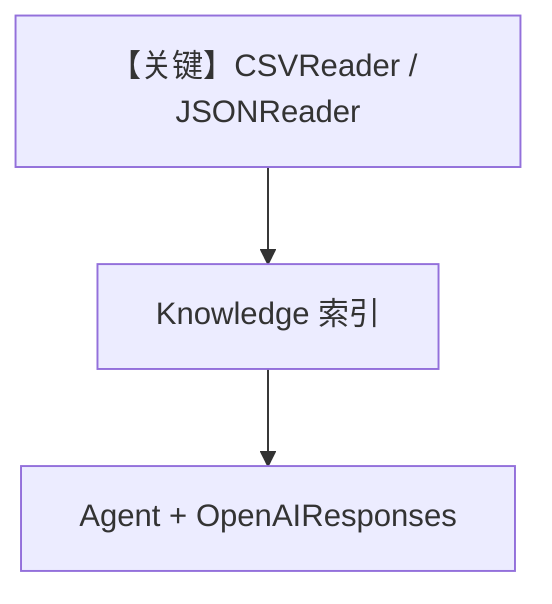

# 02_data.py — 实现原理分析

> 源文件：`cookbook/07_knowledge/05_integrations/readers/02_data.py`

## 概述

本示例展示 **结构化数据 Reader**：`CSVReader` 处理表格文本、`JSONReader` 处理 JSON 字符串；`OpenAIResponses` + RAG 查询。

**核心配置一览：**

| 配置项 | 值 | 说明 |
|--------|------|------|
| `Knowledge` | `Qdrant(hybrid)` | 向量库 |
| `Agent` | `OpenAIResponses(gpt-5.2)`, `search_knowledge=True`, `markdown=True` | Agent |

## 架构分层

```
text_content + CSVReader/JSONReader → Document 流 → 嵌入 → Agent
```

## 核心组件解析

### CSVReader

按行/行组切分为可检索单元（具体策略见 Reader 实现）。

### 运行机制与因果链

内存字符串模拟文件；生产可换为 `path=` 指向真实 CSV/JSON。

## System Prompt 组装

默认 markdown 附加段。

### 还原后的完整 System 文本

```text
<additional_information>
- Use markdown to format your answers.
</additional_information>
```

## 完整 API 请求

`OpenAIResponses` → `responses.create`。

## Mermaid 流程图



## 关键源码文件索引

| 文件 | 作用 |
|------|------|
| `agno/knowledge/reader/csv_reader.py` | CSV |
| `agno/knowledge/reader/json_reader.py` | JSON |
