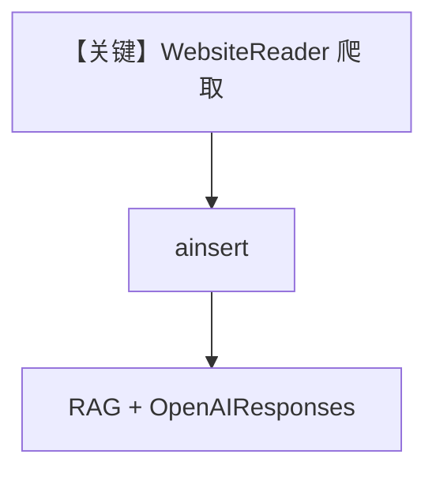

# 03_web.py — 实现原理分析

> 源文件：`cookbook/07_knowledge/05_integrations/readers/03_web.py`

## 概述

本示例展示 **Web 类 Reader**：`WebsiteReader(max_depth, max_links)` 爬取站点；直连 PDF URL 时走自动检测 Reader；`OpenAIResponses` RAG。

**核心配置一览：**

| 配置项 | 值 | 说明 |
|--------|------|------|
| `WebsiteReader` | `max_depth=1`, `max_links=5` | 爬取限制 |
| `Agent` | `OpenAIResponses(gpt-5.2)`, `search_knowledge=True` | Agent |

## 架构分层

```
URL → WebsiteReader 或默认 Reader → 文本 → 嵌入 → Qdrant → Agent
```

## 核心组件解析

### WebsiteReader

控制深度与链接上限，避免爬爆；适合文档站入门页。

### 运行机制与因果链

网络失败时 `ainsert` 可能抛错；与本地 PDF 示例相比 **依赖外网可用性**。

## System Prompt 组装

`markdown=True` 默认附加。

### 还原后的完整 System 文本

```text
<additional_information>
- Use markdown to format your answers.
</additional_information>
```

## 完整 API 请求

`responses.create`（OpenAIResponses）。

## Mermaid 流程图



## 关键源码文件索引

| 文件 | 作用 |
|------|------|
| `agno/knowledge/reader/website_reader.py` | 站点抓取 |
