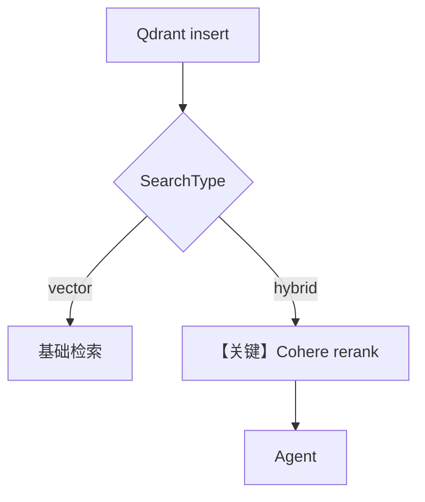

# 01_qdrant.py — 实现原理分析

<!-- cookbook-py-source:start -->
## 完整源码

```python
"""
Qdrant: Recommended Vector Database
=====================================
Qdrant is the recommended vector database for production use.
It provides fast, scalable vector search with rich filtering
capabilities, hybrid search, and reranking support.

Features:
- Vector, keyword, and hybrid search
- Reranking support
- Rich metadata filtering
- Cloud or self-hosted deployment options

Setup: ./cookbook/scripts/run_qdrant.sh

See also: 02_local.py for local dev, 03_managed.py for Pinecone, 04_pgvector.py for PostgreSQL.
"""

from agno.agent import Agent
from agno.knowledge.embedder.openai import OpenAIEmbedder
from agno.knowledge.knowledge import Knowledge
from agno.knowledge.reranker.cohere import CohereReranker
from agno.models.openai import OpenAIResponses
from agno.vectordb.qdrant import Qdrant, SearchType

# ---------------------------------------------------------------------------
# Setup
# ---------------------------------------------------------------------------

# --- Basic Qdrant setup ---
knowledge_basic = Knowledge(
    vector_db=Qdrant(
        collection="qdrant_basic",
        url="http://localhost:6333",
        embedder=OpenAIEmbedder(id="text-embedding-3-small"),
    ),
)

# --- Hybrid search with reranking ---
knowledge_advanced = Knowledge(
    vector_db=Qdrant(
        collection="qdrant_advanced",
        url="http://localhost:6333",
        search_type=SearchType.hybrid,
        embedder=OpenAIEmbedder(id="text-embedding-3-small"),
        reranker=CohereReranker(model="rerank-multilingual-v3.0"),
    ),
)

# ---------------------------------------------------------------------------
# Run Demo
# ---------------------------------------------------------------------------

if __name__ == "__main__":
    # --- Basic vector search ---
    print("\n" + "=" * 60)
    print("Qdrant: Basic vector search")
    print("=" * 60 + "\n")

    knowledge_basic.insert(
        url="https://agno-public.s3.amazonaws.com/recipes/ThaiRecipes.pdf"
    )
    agent = Agent(
        model=OpenAIResponses(id="gpt-5.2"),
        knowledge=knowledge_basic,
        search_knowledge=True,
        markdown=True,
    )
    agent.print_response("What Thai recipes do you know?", stream=True)

    # --- Hybrid search with reranking ---
    print("\n" + "=" * 60)
    print("Qdrant: Hybrid search + Cohere reranking")
    print("=" * 60 + "\n")

    knowledge_advanced.insert(
        url="https://agno-public.s3.amazonaws.com/recipes/ThaiRecipes.pdf"
    )
    agent_advanced = Agent(
        model=OpenAIResponses(id="gpt-5.2"),
        knowledge=knowledge_advanced,
        search_knowledge=True,
        markdown=True,
    )
    agent_advanced.print_response("What Thai desserts are available?", stream=True)
```

<!-- cookbook-py-source:end -->

> 源文件：`cookbook/07_knowledge/05_integrations/vector_dbs/01_qdrant.py`

## 概述

本示例对比 **Qdrant 基础向量检索** 与 **混合检索 + Cohere 重排**：`knowledge_basic` vs `knowledge_advanced`，分别 `insert` 后创建 `Agent(OpenAIResponses)` 提问。

**核心配置一览：**

| 配置项 | 值 | 说明 |
|--------|------|------|
| `knowledge_basic` | `Qdrant`, 默认向量 | 基础 |
| `knowledge_advanced` | `SearchType.hybrid` + `CohereReranker` | 混合+重排 |
| `Agent` | `OpenAIResponses(gpt-5.2)`, `search_knowledge=True`, `markdown=True` | 两次各建一个 |

## 架构分层

```
insert(PDF) → Qdrant
                 │
     ┌───────────┴───────────┐
     ▼                       ▼
  纯向量 search           hybrid + rerank
     │                       │
     └───────────┬───────────┘
                 ▼
          Agent.print_response
```

## 核心组件解析

### hybrid + reranker

先召回再重排，提高相关性；成本与延迟高于纯向量。

### 运行机制与因果链

`__main__` 顺序执行两段 demo；同一 PDF 重复插入到不同 collection。

## System Prompt 组装

`markdown=True`。

### 还原后的完整 System 文本

```text
<additional_information>
- Use markdown to format your answers.
</additional_information>
```

## 完整 API 请求

`OpenAIResponses.responses.create`；重排发生在 **Agno 检索侧**，非 OpenAI API 内。

## Mermaid 流程图



## 关键源码文件索引

| 文件 | 作用 |
|------|------|
| `agno/vectordb/qdrant` | Qdrant 适配 |
| `agno/knowledge/reranker/cohere.py` | 重排 |
