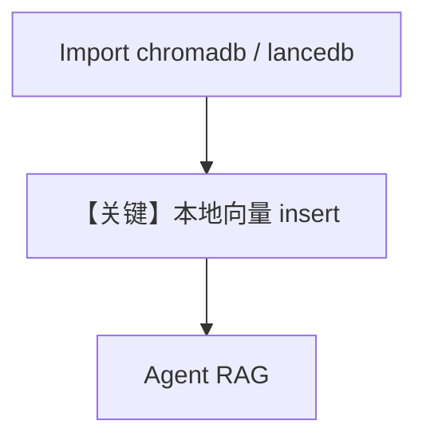

# 02_local.py — 实现原理分析

<!-- cookbook-py-source:start -->
## 完整源码

```python
"""
Local Vector Databases: ChromaDB and LanceDB
==============================================
For local development and prototyping, you can use embedded vector databases
that don't require a server.

ChromaDB:
- In-memory or persistent storage
- Simple setup, good for prototyping
- pip install chromadb

LanceDB:
- File-based storage (no server needed)
- Supports hybrid search
- pip install lancedb tantivy

See also: 01_qdrant.py for production, 03_managed.py for Pinecone, 04_pgvector.py for PostgreSQL.
"""

from agno.agent import Agent
from agno.knowledge.embedder.openai import OpenAIEmbedder
from agno.knowledge.knowledge import Knowledge
from agno.models.openai import OpenAIResponses

# ---------------------------------------------------------------------------
# ChromaDB Setup
# ---------------------------------------------------------------------------

try:
    from agno.vectordb.chroma import ChromaDb

    knowledge_chroma = Knowledge(
        vector_db=ChromaDb(
            collection="local_demo",
            embedder=OpenAIEmbedder(id="text-embedding-3-small"),
        ),
    )
except ImportError:
    knowledge_chroma = None
    print("ChromaDB not installed. Run: pip install chromadb")

# ---------------------------------------------------------------------------
# LanceDB Setup
# ---------------------------------------------------------------------------

try:
    from agno.vectordb.lancedb import LanceDb, SearchType

    knowledge_lance = Knowledge(
        vector_db=LanceDb(
            uri="tmp/lancedb",
            table_name="local_demo",
            search_type=SearchType.hybrid,
            embedder=OpenAIEmbedder(id="text-embedding-3-small"),
        ),
    )
except ImportError:
    knowledge_lance = None
    print("LanceDB not installed. Run: pip install lancedb tantivy")

# ---------------------------------------------------------------------------
# Run Demo
# ---------------------------------------------------------------------------

if __name__ == "__main__":
    pdf_url = "https://agno-public.s3.amazonaws.com/recipes/ThaiRecipes.pdf"

    if knowledge_chroma:
        print("\n" + "=" * 60)
        print("ChromaDB: in-memory vector database")
        print("=" * 60 + "\n")

        knowledge_chroma.insert(url=pdf_url)
        agent = Agent(
            model=OpenAIResponses(id="gpt-5.2"),
            knowledge=knowledge_chroma,
            search_knowledge=True,
            markdown=True,
        )
        agent.print_response("What Thai recipes do you know?", stream=True)

    if knowledge_lance:
        print("\n" + "=" * 60)
        print("LanceDB: file-based vector database with hybrid search")
        print("=" * 60 + "\n")

        knowledge_lance.insert(url=pdf_url)
        agent = Agent(
            model=OpenAIResponses(id="gpt-5.2"),
            knowledge=knowledge_lance,
            search_knowledge=True,
            markdown=True,
        )
        agent.print_response("What Thai desserts are available?", stream=True)
```

<!-- cookbook-py-source:end -->

> 源文件：`cookbook/07_knowledge/05_integrations/vector_dbs/02_local.py`

## 概述

本示例展示 **本地向量库 ChromaDB 与 LanceDB**（`try/ImportError`）：无服务端时嵌入式存储；`insert` + `Agent(OpenAIResponses)` RAG。

**核心配置一览：**

| 配置项 | 值 | 说明 |
|--------|------|------|
| `knowledge_chroma` | `ChromaDb(collection, path, persistent_client=True)` | 条件 |
| `knowledge_lance` | `LanceDb(uri, table_name, SearchType.hybrid)` | 条件 |
| `Agent` | `OpenAIResponses(gpt-5.2)`, `search_knowledge=True`, `markdown=True` | 各分支 |

## 架构分层

```
PDF → Chroma 或 Lance → Agent → OpenAIResponses
```

## 核心组件解析

### ImportError 分支

未安装依赖时打印提示并跳过，避免 import 失败。

### 运行机制与因果链

适合笔记本/CI 原型；与 Qdrant 服务相比 **无独立向量进程**（Chroma 可持久化目录）。

## System Prompt 组装

`markdown=True` 默认。

### 还原后的完整 System 文本

```text
<additional_information>
- Use markdown to format your answers.
</additional_information>
```

## 完整 API 请求

仅 LLM 为 `responses.create`；向量操作在本地库。

## Mermaid 流程图



## 关键源码文件索引

| 文件 | 作用 |
|------|------|
| `agno/vectordb/chroma` | Chroma |
| `agno/vectordb/lancedb` | Lance |
