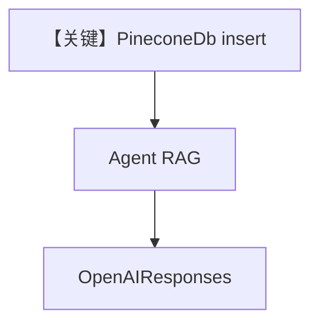

# 03_managed.py — 实现原理分析

<!-- cookbook-py-source:start -->
## 完整源码

```python
"""
Managed Vector Databases: Pinecone
====================================
Pinecone is a fully managed, serverless vector database for
production workloads where you want zero infrastructure management.

Features:
- Fully managed, serverless option available
- Automatic scaling and high availability
- Metadata filtering
- Namespaces for multi-tenancy

Requires: pip install pinecone

See also: 01_qdrant.py for recommended default, 04_pgvector.py for PostgreSQL.
"""

from os import getenv

from agno.agent import Agent
from agno.knowledge.embedder.openai import OpenAIEmbedder
from agno.knowledge.knowledge import Knowledge
from agno.models.openai import OpenAIResponses

# ---------------------------------------------------------------------------
# Pinecone Setup
# ---------------------------------------------------------------------------

try:
    from agno.vectordb.pineconedb import PineconeDb

    knowledge_pinecone = Knowledge(
        vector_db=PineconeDb(
            name="knowledge-demo",
            api_key=getenv("PINECONE_API_KEY"),
            embedder=OpenAIEmbedder(id="text-embedding-3-small"),
        ),
    )
except ImportError:
    knowledge_pinecone = None
    print("Pinecone not installed. Run: pip install pinecone")

# ---------------------------------------------------------------------------
# Run Demo
# ---------------------------------------------------------------------------

if __name__ == "__main__":
    if knowledge_pinecone:
        print("\n" + "=" * 60)
        print("Pinecone: managed serverless vector database")
        print("=" * 60 + "\n")

        knowledge_pinecone.insert(
            url="https://agno-public.s3.amazonaws.com/recipes/ThaiRecipes.pdf"
        )
        agent = Agent(
            model=OpenAIResponses(id="gpt-5.2"),
            knowledge=knowledge_pinecone,
            search_knowledge=True,
            markdown=True,
        )
        agent.print_response("What Thai recipes do you know?", stream=True)
    else:
        print("Skipping demo: Pinecone not installed.")
```

<!-- cookbook-py-source:end -->

> 源文件：`cookbook/07_knowledge/05_integrations/vector_dbs/03_managed.py`

## 概述

本示例展示 **Pinecone 托管向量库**（`try/ImportError`）：`PINECONE_API_KEY` + `PineconeDb`，`insert` PDF 后 `Agent(OpenAIResponses)` RAG。

**核心配置一览：**

| 配置项 | 值 | 说明 |
|--------|------|------|
| `PineconeDb` | `name`, `api_key`, `embedder` | 托管库 |
| `Agent` | `OpenAIResponses(gpt-5.2)`, `search_knowledge=True`, `markdown=True` | 条件执行 |

## 架构分层

```
Pinecone ← Knowledge.insert ← Agent → OpenAI
```

## 核心组件解析

未安装 `pinecone` 时跳过 demo，打印安装提示。

### 运行机制与因果链

云上命名空间/索引由 Pinecone 控制台与 SDK 管理；与自托管 Qdrant 运维模型不同。

## System Prompt 组装

`markdown=True`。

### 还原后的完整 System 文本

```text
<additional_information>
- Use markdown to format your answers.
</additional_information>
```

## 完整 API 请求

`responses.create`；向量请求走 Pinecone HTTP API。

## Mermaid 流程图



## 关键源码文件索引

| 文件 | 作用 |
|------|------|
| `agno/vectordb/pineconedb` | Pinecone 适配 |
