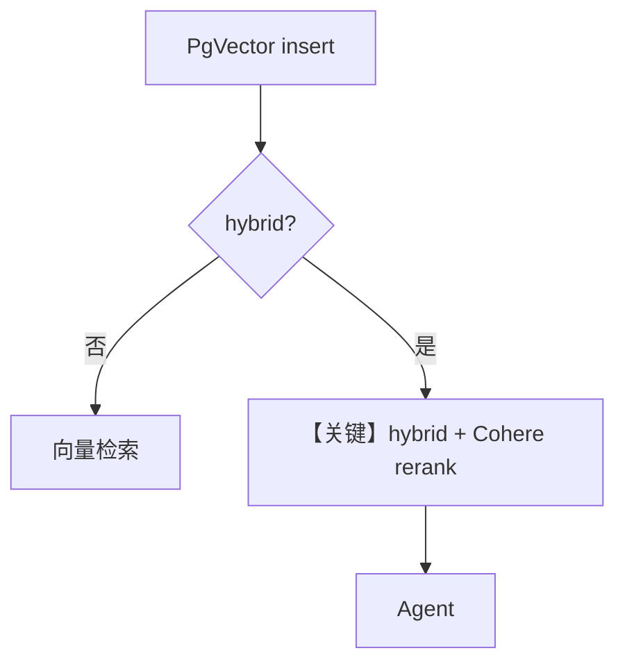

# 04_pgvector.py — 实现原理分析

> 源文件：`cookbook/07_knowledge/05_integrations/vector_dbs/04_pgvector.py`

## 概述

本示例对比 **PgVector 基础向量** 与 **混合 + Cohere 重排**（同 `01_qdrant.py` 结构，换为 PostgreSQL + pgvector 扩展）。

**核心配置一览：**

| 配置项 | 值 | 说明 |
|--------|------|------|
| `db_url` | `postgresql+psycopg://ai:ai@localhost:5532/ai` | 本地 PG |
| `knowledge_basic` | `PgVector(table_name=..., hybrid 默认关)` | 基础 |
| `knowledge_hybrid` | `SearchType.hybrid` + `CohereReranker` | 高级 |
| `Agent` | `OpenAIResponses(gpt-5.2)`, `search_knowledge=True`, `markdown=True` | 两次 |

## 架构分层

```
insert → PgVector 表 → （可选）hybrid+rerank → Agent → Responses API
```

## 核心组件解析

关系库与向量同机部署，便于与业务表 JOIN（本示例未演示 SQL，仅表名隔离）。

### 运行机制与因果链

需 `./cookbook/scripts/run_pgvector.sh` 启动带 pgvector 的实例。

## System Prompt 组装

默认 markdown 附加。

### 还原后的完整 System 文本

```text
<additional_information>
- Use markdown to format your answers.
</additional_information>
```

## 完整 API 请求

`OpenAIResponses`；检索重排在 Agno 层。

## Mermaid 流程图



## 关键源码文件索引

| 文件 | 作用 |
|------|------|
| `agno/vectordb/pgvector` | PgVector |
| `agno/knowledge/reranker/cohere.py` | 重排 |
