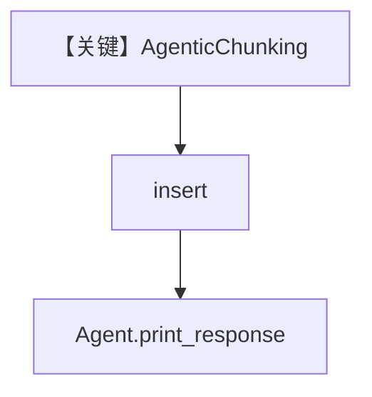

# agentic_chunking.py — 实现原理分析

> 源文件：`cookbook/07_knowledge/09_archive/chunking/agentic_chunking.py`

## 概述

本示例展示 **`AgenticChunking`**：由 LLM 参与决策的切块策略，配合 `PDFReader` 与 `PgVector` 摄入，**Agent 未显式指定 model**（依赖框架/环境默认）。

**核心配置一览：**

| 配置项 | 值 | 说明 |
|--------|------|------|
| `Knowledge.vector_db` | `PgVector(table_name=recipes_agentic_chunking)` | PG 向量 |
| `PDFReader` | `chunking_strategy=AgenticChunking()` | 智能分块 |
| `Agent` | `knowledge`, `search_knowledge=True`，无 `model` | 需运行时默认模型 |

## 架构分层

```
PDF → AgenticChunking → 分块嵌入 → PgVector → Agent RAG
```

## 核心组件解析

### AgenticChunking

与固定规则分块不同，切块边界可由模型/策略链动态决定（详见 `agno/knowledge/chunking/agentic`）。

### 运行机制与因果链

1. 摄入路径：`knowledge.insert` + 特殊 Reader。
2. **务必确认** `Agent.model` 在运行环境中可用，否则 `print_response` 失败。

## System Prompt 组装

若默认 `model` 可用，则走标准 `get_system_message`；`markdown=True` 在 `print_response` 参数中。

### 还原说明

未显式 `instructions`；system 以默认拼装为准，运行时可打印验证。

## 完整 API 请求

取决于解析到的默认 `Model` 类（OpenAI 系多为 `chat.completions` 或 `responses`）。

## Mermaid 流程图



## 关键源码文件索引

| 文件 | 作用 |
|------|------|
| `agno/knowledge/chunking/agentic` | Agentic 分块 |
| `agno/vectordb/pgvector` | 存储 |
