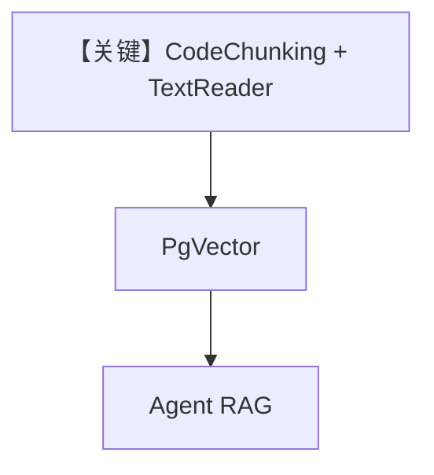

# code_chunking.py — 实现原理分析

<!-- cookbook-py-source:start -->
## 完整源码

```python
from agno.agent import Agent
from agno.knowledge.chunking.code import CodeChunking
from agno.knowledge.knowledge import Knowledge
from agno.knowledge.reader.text_reader import TextReader
from agno.vectordb.pgvector import PgVector

db_url = "postgresql+psycopg://ai:ai@localhost:5532/ai"

knowledge = Knowledge(
    vector_db=PgVector(table_name="python_code_chunking", db_url=db_url),
)

# Add code with CodeChunking
knowledge.insert(
    url="https://raw.githubusercontent.com/agno-agi/agno/main/libs/agno/agno/session/workflow.py",
    reader=TextReader(
        chunking_strategy=CodeChunking(
            tokenizer="gpt2", chunk_size=500, language="python", include_nodes=False
        ),
    ),
)

# Query with agent
agent = Agent(knowledge=knowledge, search_knowledge=True)
agent.print_response("How does the Workflow class work?", markdown=True)
```

<!-- cookbook-py-source:end -->

> 源文件：`cookbook/07_knowledge/09_archive/chunking/code_chunking.py`

## 概述

本示例展示 **`CodeChunking`**：对远程 Python 源码 URL 使用 `TextReader` + `tokenizer="gpt2"` 等参数按 token 窗口切分，写入 `PgVector` 后由 **无显式 model 的 Agent** 问答。

**核心配置一览：**

| 配置项 | 值 | 说明 |
|--------|------|------|
| `CodeChunking` | `chunk_size=500`, `language="python"` | 代码分块 |
| `TextReader` | 包装 URL 文本 | 拉取源码 |
| `Knowledge` | `PgVector` | 向量表 `python_code_chunking` |
| `Agent` | `knowledge`, `search_knowledge=True` | 无 model |

## 架构分层

```
raw URL → TextReader → CodeChunking → PgVector → Agent
```

## 核心组件解析

适合代码库 RAG：按语法/ token 边界切块，减少截断函数体。

### 运行机制与因果链

检索针对 **workflow.py** 一类源码；问题聚焦类/行为说明。

## System Prompt 组装

依赖默认 Agent 模型；无显式 `instructions`。

## 完整 API 请求

由默认 `Model` 决定。

## Mermaid 流程图



## 关键源码文件索引

| 文件 | 作用 |
|------|------|
| `agno/knowledge/chunking/code.py` | `CodeChunking` |
