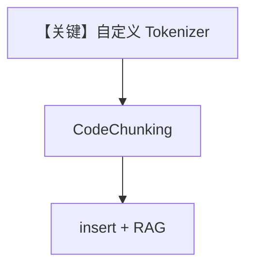

# code_chunking_custom_tokenizer.py — 实现原理分析

> 源文件：`cookbook/07_knowledge/09_archive/chunking/code_chunking_custom_tokenizer.py`

## 概述

在 `CodeChunking` 上挂载 **自定义 chonkie `Tokenizer`**（`LineTokenizer`：按行计数/编码），演示 **非 GPT2 预置分词器** 的代码切块管线；`PgVector` + Agent 查询。

**核心配置一览：**

| 配置项 | 值 | 说明 |
|--------|------|------|
| `LineTokenizer` | 自定义 `Tokenizer` 子类 | 行级 token |
| `CodeChunking` | `tokenizer=LineTokenizer()`, `chunk_size=500` | 分块 |
| `Agent` | 无显式 model | 同系列归档示例 |

## 架构分层

```
URL 源码 → TextReader → CodeChunking(自定义 tokenizer) → PgVector → Agent
```

## 核心组件解析

当行级语义比子词更适合仓库（如按函数行聚合）时可替换 `LineTokenizer`。

### 运行机制与因果链

依赖 `chonkie`；`encode`/`decode` 需与 `CodeChunking` 期望一致。

## System Prompt 组装

默认 Agent system（若 model 可用）。

## 完整 API 请求

取决于默认 Model。

## Mermaid 流程图



## 关键源码文件索引

| 文件 | 作用 |
|------|------|
| `agno/knowledge/chunking/code.py` | `CodeChunking` |
