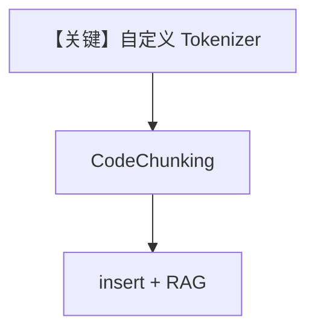

# code_chunking_custom_tokenizer.py — 实现原理分析

<!-- cookbook-py-source:start -->
## 完整源码

```python
from typing import Sequence

from agno.agent import Agent
from agno.knowledge.chunking.code import CodeChunking
from agno.knowledge.knowledge import Knowledge
from agno.knowledge.reader.text_reader import TextReader
from agno.vectordb.pgvector import PgVector
from chonkie.tokenizer import Tokenizer

db_url = "postgresql+psycopg://ai:ai@localhost:5532/ai"


class LineTokenizer(Tokenizer):
    """Custom tokenizer that counts lines of code."""

    def __init__(self):
        self.vocab = []
        self.token2id = {}

    def __repr__(self) -> str:
        return f"LineTokenizer(vocab_size={len(self.vocab)})"

    def tokenize(self, text: str) -> Sequence[str]:
        if not text:
            return []
        return text.split("\n")

    def encode(self, text: str) -> Sequence[int]:
        encoded = []
        for token in self.tokenize(text):
            if token not in self.token2id:
                self.token2id[token] = len(self.vocab)
                self.vocab.append(token)
            encoded.append(self.token2id[token])
        return encoded

    def decode(self, tokens: Sequence[int]) -> str:
        try:
            return "\n".join([self.vocab[token] for token in tokens])
        except Exception as e:
            raise ValueError(
                f"Decoding failed. Tokens: {tokens} not found in vocab."
            ) from e

    def count_tokens(self, text: str) -> int:
        if not text:
            return 0
        return len(text.split("\n"))


knowledge = Knowledge(
    vector_db=PgVector(table_name="code_custom_tokenizer", db_url=db_url),
)

knowledge.insert(
    url="https://raw.githubusercontent.com/agno-agi/agno/main/libs/agno/agno/session/workflow.py",
    reader=TextReader(
        chunking_strategy=CodeChunking(
            tokenizer=LineTokenizer(),
            chunk_size=500,
            language="python",
        ),
    ),
)

agent = Agent(
    knowledge=knowledge,
    search_knowledge=True,
)

agent.print_response("How does the Workflow class work?", markdown=True)
```

<!-- cookbook-py-source:end -->

> 源文件：`cookbook/07_knowledge/09_archive/chunking/code_chunking_custom_tokenizer.py`

## 概述

在 `CodeChunking` 上挂载 **自定义 chonkie `Tokenizer`**（`LineTokenizer`：按行计数/编码），演示 **非 GPT2 预置分词器** 的代码切块管线；`PgVector` + Agent 查询。

**核心配置一览：**

| 配置项 | 值 | 说明 |
|--------|------|------|
| `LineTokenizer` | 自定义 `Tokenizer` 子类 | 行级 token |
| `CodeChunking` | `tokenizer=LineTokenizer()`, `chunk_size=500` | 分块 |
| `Agent` | 无显式 model | 同系列归档示例 |

## 架构分层

```
URL 源码 → TextReader → CodeChunking(自定义 tokenizer) → PgVector → Agent
```

## 核心组件解析

当行级语义比子词更适合仓库（如按函数行聚合）时可替换 `LineTokenizer`。

### 运行机制与因果链

依赖 `chonkie`；`encode`/`decode` 需与 `CodeChunking` 期望一致。

## System Prompt 组装

默认 Agent system（若 model 可用）。

## 完整 API 请求

取决于默认 Model。

## Mermaid 流程图



## 关键源码文件索引

| 文件 | 作用 |
|------|------|
| `agno/knowledge/chunking/code.py` | `CodeChunking` |
