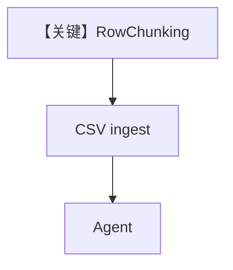

# csv_row_chunking.py — 实现原理分析

> 源文件：`cookbook/07_knowledge/09_archive/chunking/csv_row_chunking.py`

## 概述

本示例展示 **`RowChunking`** + `CSVReader`：IMDB CSV 按行变为检索单元，`PgVector` 索引后 Agent 查询单部电影信息。

**核心配置一览：**

| 配置项 | 值 | 说明 |
|--------|------|------|
| `RowChunking` | 行级切块 | 表数据 |
| `knowledge_base` | `PgVector(imdb_movies_row_chunking)` | 存储 |
| `Agent` | 无显式 model | 默认模型 |

## 架构分层

```
CSV URL → CSVReader(RowChunking) → PgVector → Agent
```

## 核心组件解析

表格问答场景：**每行一条向量**，避免多行混在一个 chunk 导致检索模糊。

## System Prompt 组装

默认。

## 完整 API 请求

默认 Model。

## Mermaid 流程图



## 关键源码文件索引

| 文件 | 作用 |
|------|------|
| `agno/knowledge/chunking/row.py` | `RowChunking` |
