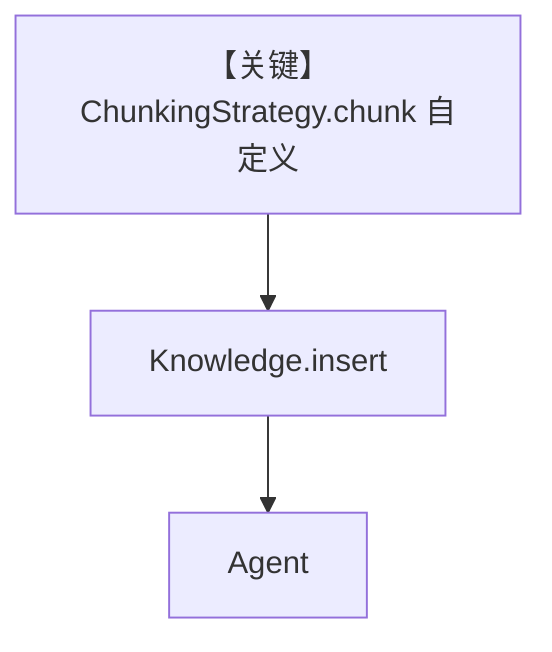

# custom_strategy_example.py — 实现原理分析

<!-- cookbook-py-source:start -->
## 完整源码

```python
from typing import List

from agno.agent import Agent
from agno.knowledge.chunking.strategy import ChunkingStrategy
from agno.knowledge.document.base import Document
from agno.knowledge.knowledge import Knowledge
from agno.knowledge.reader.pdf_reader import PDFReader
from agno.vectordb.pgvector import PgVector


class CustomSeparatorChunking(ChunkingStrategy):
    """
    Example implementation of a custom chunking strategy.

    This demonstrates how you can implement your own chunking strategy by:
    1. Inheriting from ChunkingStrategy
    2. Implementing the chunk() method
    3. Using the inherited clean_text() method
    4. Adding your own custom logic and parameters

    You can extend this pattern for your specific needs:
    - Different splitting logic (regex patterns, AI-based splitting, etc.)
    - Custom parameters (max_words, min_length, overlap, etc.)
    - Domain-specific chunking (code blocks, tables, sections, etc.)
    - Custom metadata and chunk enrichment
    """

    def __init__(self, separator: str = "---", **kwargs):
        """
        Initialize your custom chunking strategy.

        Args:
            separator: The string pattern to split documents on
            **kwargs: Additional parameters for your custom logic
        """
        self.separator = separator

    def chunk(self, document: Document) -> List[Document]:
        """
        Implement your custom chunking logic.

        This method receives a Document and must return a list of chunked Documents.
        You can implement any splitting logic here - this example uses simple separator splitting.
        """
        # Split by your custom separator
        chunks = document.content.split(self.separator)

        result = []
        for i, chunk_content in enumerate(chunks):
            # Use the inherited clean_text method for consistent text processing
            chunk_content = self.clean_text(chunk_content)

            if chunk_content:  # Only create non-empty chunks
                # Preserve original metadata and add chunk-specific info
                meta_data = document.meta_data.copy()
                meta_data["chunk"] = i + 1
                meta_data["separator_used"] = self.separator  # Your custom metadata
                meta_data["chunking_strategy"] = "custom_separator"

                result.append(
                    Document(
                        id=f"{document.id}_{i + 1}" if document.id else None,
                        name=document.name,
                        meta_data=meta_data,
                        content=chunk_content,
                    )
                )
        return result


# Example usage showing how to use your custom chunking strategy
db_url = "postgresql+psycopg://ai:ai@localhost:5532/ai"

knowledge = Knowledge(
    vector_db=PgVector(table_name="recipes_custom_strategy", db_url=db_url),
)

# Use your custom chunking strategy with any reader
# You can customize the separator based on your document structure:
# - "###" for markdown headers
# - "||" for data separators
# - "\n\n" for paragraph breaks
# - "---" for section dividers
# - Any custom pattern that fits your content
knowledge.insert(
    url="https://agno-public.s3.amazonaws.com/recipes/ThaiRecipes.pdf",
    reader=PDFReader(
        name="Custom Strategy Reader",
        chunking_strategy=CustomSeparatorChunking(separator="---"),
    ),
)

agent = Agent(
    knowledge=knowledge,
    search_knowledge=True,
)

agent.print_response("How to make Thai curry?", markdown=True)
```

<!-- cookbook-py-source:end -->

> 源文件：`cookbook/07_knowledge/09_archive/chunking/custom_strategy_example.py`

## 概述

本示例实现 **`CustomSeparatorChunking(ChunkingStrategy)`**：按自定义分隔符（默认 `"---"`）切分 PDF 内容，展示 `chunk()` 返回多 `Document` 并合并元数据；`PgVector` + Agent。

**核心配置一览：**

| 配置项 | 值 | 说明 |
|--------|------|------|
| `CustomSeparatorChunking` | `separator` 可配 | 自定义切分 |
| `PDFReader` | 传入自定义 strategy | 读 PDF |
| `Agent` | 无显式 model | 默认 |

## 架构分层

```
PDF → PDFReader → CustomSeparatorChunking.chunk → PgVector → Agent
```

## 核心组件解析

`clean_text()` 继承用法与 `meta_data` 扩展（`chunk`, `separator_used`）便于调试与过滤。

### 运行机制与因果链

分隔符需与文档中实际字符串对齐，否则可能单大块。

## System Prompt 组装

默认。

## 完整 API 请求

默认 Model。

## Mermaid 流程图



## 关键源码文件索引

| 文件 | 作用 |
|------|------|
| `agno/knowledge/chunking/strategy.py` | 基类与契约 |
