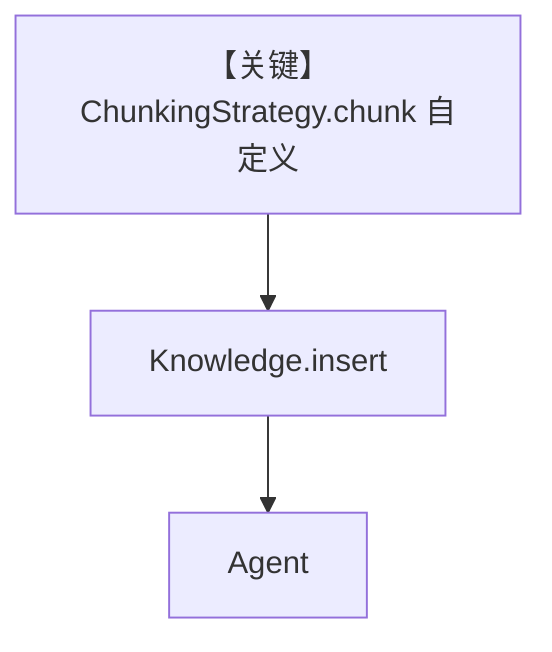

# custom_strategy_example.py — 实现原理分析

> 源文件：`cookbook/07_knowledge/09_archive/chunking/custom_strategy_example.py`

## 概述

本示例实现 **`CustomSeparatorChunking(ChunkingStrategy)`**：按自定义分隔符（默认 `"---"`）切分 PDF 内容，展示 `chunk()` 返回多 `Document` 并合并元数据；`PgVector` + Agent。

**核心配置一览：**

| 配置项 | 值 | 说明 |
|--------|------|------|
| `CustomSeparatorChunking` | `separator` 可配 | 自定义切分 |
| `PDFReader` | 传入自定义 strategy | 读 PDF |
| `Agent` | 无显式 model | 默认 |

## 架构分层

```
PDF → PDFReader → CustomSeparatorChunking.chunk → PgVector → Agent
```

## 核心组件解析

`clean_text()` 继承用法与 `meta_data` 扩展（`chunk`, `separator_used`）便于调试与过滤。

### 运行机制与因果链

分隔符需与文档中实际字符串对齐，否则可能单大块。

## System Prompt 组装

默认。

## 完整 API 请求

默认 Model。

## Mermaid 流程图



## 关键源码文件索引

| 文件 | 作用 |
|------|------|
| `agno/knowledge/chunking/strategy.py` | 基类与契约 |
